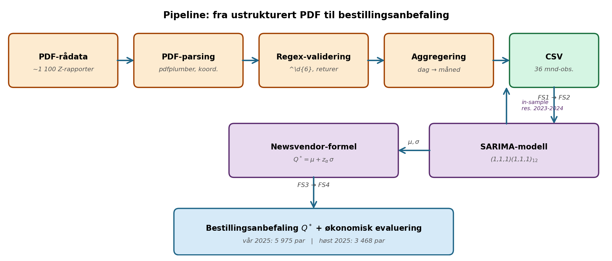
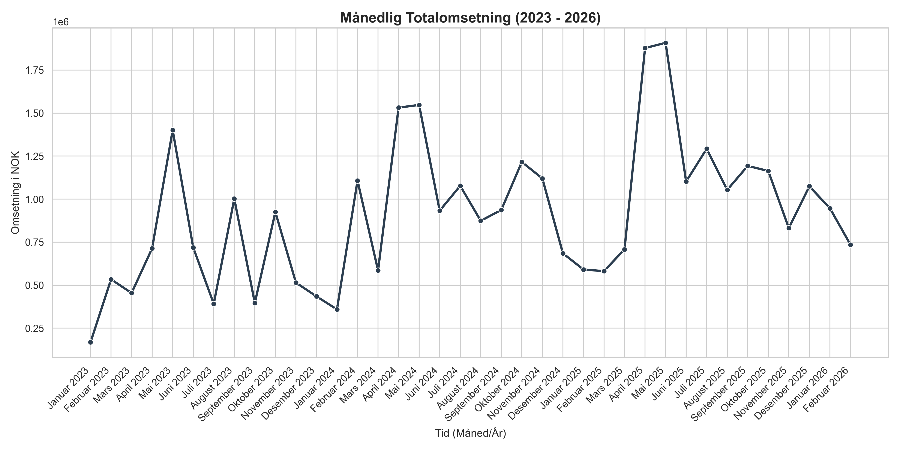
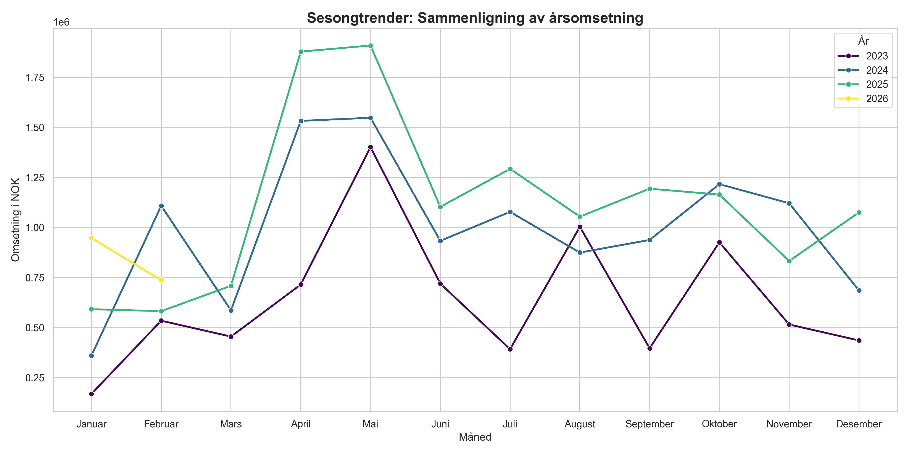
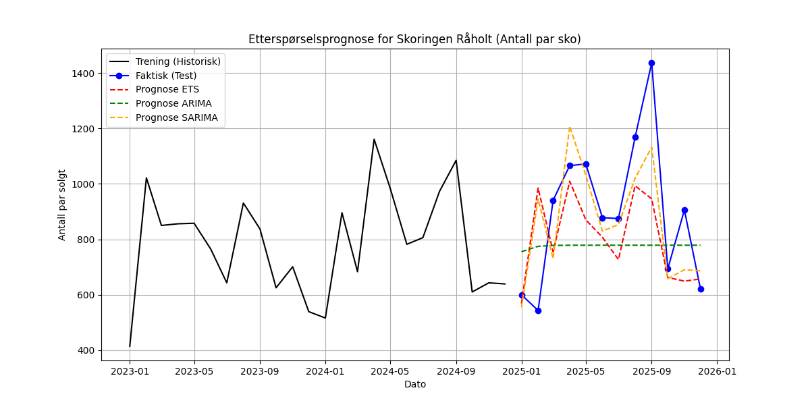
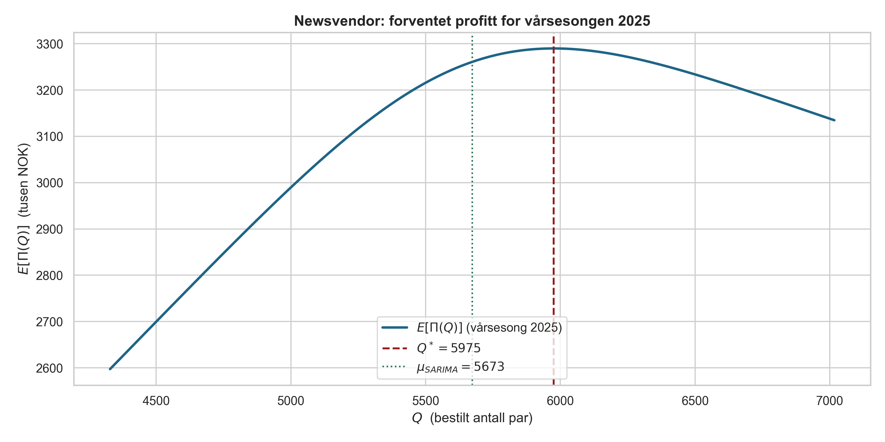
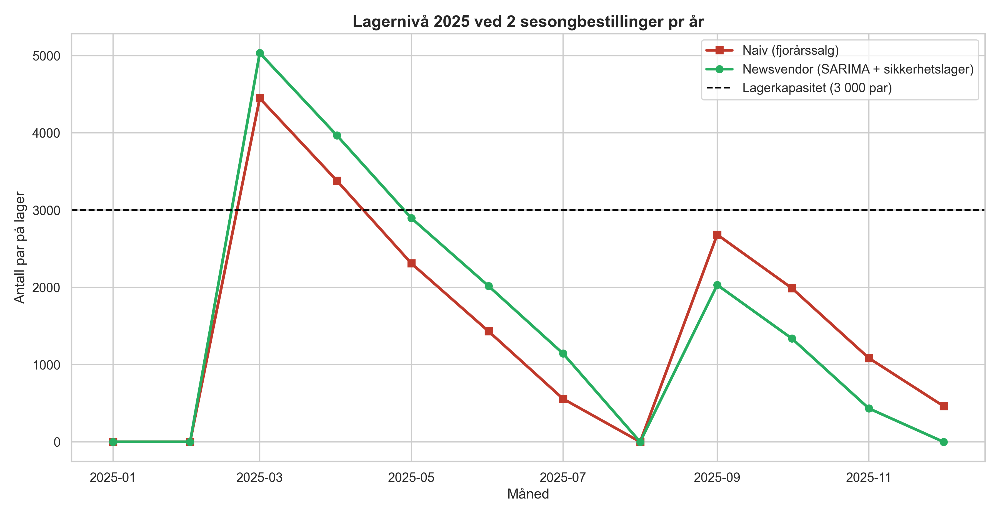
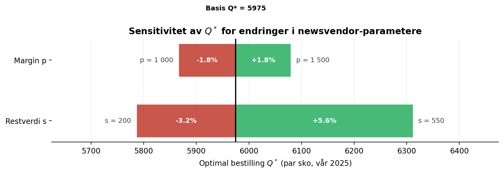

<div class="title-page">
<div class="tp-section tp-top">
<span class="institution-line">Høgskolen i Molde</span>
<span class="institution-sub">Vitenskapelig høgskole i logistikk</span>
<div class="course-tag">LOG650 — Forskningsprosjekt i logistikk · Vårsemesteret 2026</div>
</div>
<div class="tp-section tp-mid">
<hr class="title-rule">
<div class="thesis-title">Sesongbestilling under prognoseusikkerhet</div>
<div class="thesis-subtitle">En case-studie av Skoringen Råholt med SARIMA-prognose og newsvendor-logikk</div>
<hr class="title-rule">
</div>
<div class="tp-section tp-authors">
<span class="authors-label">Forfattere</span>
<div class="authors">Gustavo Alfonso Holmedal<br>Thuy Thu Thi Tran<br>Inger Irgesund</div>
<div class="group-line">Gruppe 4.5</div>
</div>
<div class="tp-section tp-footer">
<span class="footer-meta">Forskningsoppgave <span class="meta-divider">·</span> April 2026</span>
</div>
</div>


## Innholdsfortegnelse

<style>
.toc-list { font-family: "Charter", "Source Serif Pro", Georgia, serif; margin: 1rem 0 2rem; }
.toc-row { display: flex; align-items: baseline; gap: 0.4rem; line-height: 1.55; padding: 0.05rem 0; }
.toc-text { white-space: nowrap; overflow: hidden; text-overflow: ellipsis; }
.toc-dots { flex: 1 1 auto; border-bottom: 1px dotted #888; transform: translateY(-4px); min-width: 1.5rem; }
.toc-page { white-space: nowrap; font-variant-numeric: tabular-nums; min-width: 1.6rem; text-align: right; color: #1a1a1a; }
.toc-l1 { font-weight: 700; margin-top: 0.55rem; }
.toc-l1 .toc-page { font-weight: 700; }
.toc-l2 { padding-left: 2rem; font-weight: 400; color: #333; }
.toc-l3 { padding-left: 4rem; font-weight: 400; color: #555; font-style: italic; }
@media print {
  .toc-row { page-break-inside: avoid; }
  .toc-dots { border-bottom-color: #555; }
}
</style>
<div class="toc-list">
<div class="toc-row toc-l1"><span class="toc-text">Sammendrag</span><span class="toc-dots"></span><span class="toc-page">4</span></div>
<div class="toc-row toc-l1"><span class="toc-text">1. Innledning</span><span class="toc-dots"></span><span class="toc-page">6</span></div>
<div class="toc-row toc-l2"><span class="toc-text">1.1 Bakgrunn: detaljhandel i en periode med strukturendring</span><span class="toc-dots"></span><span class="toc-page">6</span></div>
<div class="toc-row toc-l2"><span class="toc-text">1.2 Skobransjen som logistisk kontekst</span><span class="toc-dots"></span><span class="toc-page">6</span></div>
<div class="toc-row toc-l2"><span class="toc-text">1.3 Casebedriften: Skoringen Råholt</span><span class="toc-dots"></span><span class="toc-page">7</span></div>
<div class="toc-row toc-l2"><span class="toc-text">1.4 Problemstilling og forskningsspørsmål</span><span class="toc-dots"></span><span class="toc-page">8</span></div>
<div class="toc-row toc-l2"><span class="toc-text">1.5 Avgrensninger og leveranser</span><span class="toc-dots"></span><span class="toc-page">9</span></div>
<div class="toc-row toc-l1"><span class="toc-text">2. Teoretisk rammeverk</span><span class="toc-dots"></span><span class="toc-page">9</span></div>
<div class="toc-row toc-l2"><span class="toc-text">2.1 Lagerstyringens utvikling: Fra EOQ til prognosedrevet bestilling</span><span class="toc-dots"></span><span class="toc-page">9</span></div>
<div class="toc-row toc-l2"><span class="toc-text">2.2 Tidsserieanalyse og dekomponering av etterspørsel</span><span class="toc-dots"></span><span class="toc-page">10</span></div>
<div class="toc-row toc-l2"><span class="toc-text">2.3 SARIMA-modellen: Box-Jenkins-metodologien</span><span class="toc-dots"></span><span class="toc-page">11</span></div>
<div class="toc-row toc-l2"><span class="toc-text">2.4 Newsvendor-modellen: optimal bestilling under usikkerhet</span><span class="toc-dots"></span><span class="toc-page">12</span></div>
<div class="toc-row toc-l2"><span class="toc-text">2.5 Bullwhip-effekten og forsyningskjedekoordinering</span><span class="toc-dots"></span><span class="toc-page">13</span></div>
<div class="toc-row toc-l2"><span class="toc-text">2.6 Litteratursøk og forskningshull</span><span class="toc-dots"></span><span class="toc-page">14</span></div>
<div class="toc-row toc-l2"><span class="toc-text">2.7 Kobling mellom oppgave, primærkilder og pensumkompendiet</span><span class="toc-dots"></span><span class="toc-page">15</span></div>
<div class="toc-row toc-l1"><span class="toc-text">3. Metode</span><span class="toc-dots"></span><span class="toc-page">17</span></div>
<div class="toc-row toc-l2"><span class="toc-text">3.1 Forskningsdesign og vitenskapsteoretisk forankring</span><span class="toc-dots"></span><span class="toc-page">17</span></div>
<div class="toc-row toc-l2"><span class="toc-text">3.2 Datafangst (FS1): Fra ustrukturerte PDF til strukturert tidsserie</span><span class="toc-dots"></span><span class="toc-page">18</span></div>
<div class="toc-row toc-l2"><span class="toc-text">3.3 Datavasking og preparering</span><span class="toc-dots"></span><span class="toc-page">19</span></div>
<div class="toc-row toc-l2"><span class="toc-text">3.4 Modellering og modellvalg (FS2)</span><span class="toc-dots"></span><span class="toc-page">20</span></div>
<div class="toc-row toc-l2"><span class="toc-text">3.5 Newsvendor-implementering (FS3)</span><span class="toc-dots"></span><span class="toc-page">21</span></div>
<div class="toc-row toc-l2"><span class="toc-text">3.6 Økonomisk evaluering (FS4)</span><span class="toc-dots"></span><span class="toc-page">22</span></div>
<div class="toc-row toc-l2"><span class="toc-text">3.7 Samletabell over sentrale antakelser</span><span class="toc-dots"></span><span class="toc-page">23</span></div>
<div class="toc-row toc-l1"><span class="toc-text">4. Empirisk analyse og resultater</span><span class="toc-dots"></span><span class="toc-page">25</span></div>
<div class="toc-row toc-l2"><span class="toc-text">4.1 Beskrivende analyse av datasettet (FS1)</span><span class="toc-dots"></span><span class="toc-page">25</span></div>
<div class="toc-row toc-l2"><span class="toc-text">4.2 Prognosepresisjon (FS2)</span><span class="toc-dots"></span><span class="toc-page">27</span></div>
<div class="toc-row toc-l2"><span class="toc-text">4.3 Newsvendor-bestilling (FS3)</span><span class="toc-dots"></span><span class="toc-page">30</span></div>
<div class="toc-row toc-l2"><span class="toc-text">4.4 Økonomisk effekt og lagerprofil (FS4)</span><span class="toc-dots"></span><span class="toc-page">32</span></div>
<div class="toc-row toc-l1"><span class="toc-text">5. Diskusjon</span><span class="toc-dots"></span><span class="toc-page">36</span></div>
<div class="toc-row toc-l2"><span class="toc-text">5.1 Informasjon som beslutningsstøtte – ikke som lagererstatning</span><span class="toc-dots"></span><span class="toc-page">37</span></div>
<div class="toc-row toc-l2"><span class="toc-text">5.2 Bullwhip-effekten og leverandørsamarbeid</span><span class="toc-dots"></span><span class="toc-page">38</span></div>
<div class="toc-row toc-l2"><span class="toc-text">5.3 Begrensninger og forutsetninger</span><span class="toc-dots"></span><span class="toc-page">38</span></div>
<div class="toc-row toc-l2"><span class="toc-text">5.4 Bærekraft og samfunnsmessige implikasjoner</span><span class="toc-dots"></span><span class="toc-page">40</span></div>
<div class="toc-row toc-l2"><span class="toc-text">5.5 Implementering, endringsledelse og organisasjonskultur</span><span class="toc-dots"></span><span class="toc-page">40</span></div>
<div class="toc-row toc-l2"><span class="toc-text">5.6 Oppsummerende diskusjonsoversikt (FS1–FS4)</span><span class="toc-dots"></span><span class="toc-page">41</span></div>
<div class="toc-row toc-l2"><span class="toc-text">5.7 Studiens bidrag til faget</span><span class="toc-dots"></span><span class="toc-page">42</span></div>
<div class="toc-row toc-l2"><span class="toc-text">5.8 Forventede og uventede funn</span><span class="toc-dots"></span><span class="toc-page">42</span></div>
<div class="toc-row toc-l1"><span class="toc-text">6. Konklusjon og anbefalinger</span><span class="toc-dots"></span><span class="toc-page">43</span></div>
<div class="toc-row toc-l2"><span class="toc-text">6.1 Hovedfunn</span><span class="toc-dots"></span><span class="toc-page">43</span></div>
<div class="toc-row toc-l2"><span class="toc-text">6.2 Svar på forskningsspørsmålene</span><span class="toc-dots"></span><span class="toc-page">44</span></div>
<div class="toc-row toc-l2"><span class="toc-text">6.3 Anbefalinger til Skoringen Råholt</span><span class="toc-dots"></span><span class="toc-page">45</span></div>
<div class="toc-row toc-l2"><span class="toc-text">6.4 Videre arbeid</span><span class="toc-dots"></span><span class="toc-page">46</span></div>
<div class="toc-row toc-l2"><span class="toc-text">6.5 Avsluttende refleksjon</span><span class="toc-dots"></span><span class="toc-page">46</span></div>
<div class="toc-row toc-l1"><span class="toc-text">7. Referanser</span><span class="toc-dots"></span><span class="toc-page">47</span></div>
<div class="toc-row toc-l2"><span class="toc-text">Pensum (LOG650-kompendiet) – arbeidsredskap</span><span class="toc-dots"></span><span class="toc-page">47</span></div>
<div class="toc-row toc-l2"><span class="toc-text">Akademisk litteratur</span><span class="toc-dots"></span><span class="toc-page">48</span></div>
<div class="toc-row toc-l1"><span class="toc-text">8. Vedlegg</span><span class="toc-dots"></span><span class="toc-page">49</span></div>
<div class="toc-row toc-l2"><span class="toc-text">Vedlegg A – Variabler og notasjon</span><span class="toc-dots"></span><span class="toc-page">49</span></div>
<div class="toc-row toc-l2"><span class="toc-text">Vedlegg B – Datasett, kode og artefakter</span><span class="toc-dots"></span><span class="toc-page">50</span></div>
<div class="toc-row toc-l2"><span class="toc-text">Vedlegg C – Reproduksjon</span><span class="toc-dots"></span><span class="toc-page">51</span></div>
<div class="toc-row toc-l2"><span class="toc-text">Vedlegg D – Pensumkompendiets struktur</span><span class="toc-dots"></span><span class="toc-page">52</span></div>
<div class="toc-row toc-l2"><span class="toc-text">Vedlegg E – Forkortelser og begreper</span><span class="toc-dots"></span><span class="toc-page">52</span></div>
</div>

---

<div style="page-break-before: always;"></div>

## Sammendrag
Norske skobutikker er bundet av leverandørenes produksjons- og bestillingssyklus, og plasserer normalt kun to bestillinger per år: én før vårsesongen og én før høstsesongen (intervju med daglig leder Skoringen Råholt, jan. 2026; jf. også Pinedo 2016 om sjelden, satsvis bestilling under all-units-rabatt). I praksis betyr dette at hvert år har kun to beslutningsøyeblikk hvor butikken må forplikte seg til volumet for de neste seks månedene, ofte med leveringstid på flere uker. Med så få beslutningsøyeblikk blir treffsikkerheten i hver bestilling den dominerende lønnsomhetsdriveren: en bestilling som er for stor binder kapital og gir kostbare nedsalg ved sesongslutt, mens en bestilling som er for liten gir tomme hyller, tapte kunder og varig redusert kundelojalitet i et marked hvor konkurrentene er tilgjengelige på mobilen i løpet av sekunder.

Denne oppgaven undersøker hvordan en kombinasjon av Seasonal ARIMA (SARIMA) for etterspørselsprognose (Box et al., 2015; Hyndman & Athanasopoulos, 2021) og newsvendor-modellen for bestillingsmengde (Petruzzi & Dada, 1999; Silver et al., 2016) kan forbedre sesongbestillingene hos Skoringen Råholt sammenlignet med dagens praksis. Studien er gjennomført som en kvantitativ casestudie med deduktiv tilnærming, der etablerte modeller testes mot reelle salgsdata over treårsperioden 2023–2025.

Vi har bygget en automatisert pipeline i Python som ekstraherer daglige salgsrapporter fra PDF-format ved hjelp av koordinatbasert parsing (`pdfplumber`), aggregerer dataene til månedlige tidsserier og estimerer SARIMA-modeller via et automatisert grid-søk basert på Akaike Information Criterion (AIC). Modellen ble validert mot 2025-data i et *out-of-sample*-design hvor 2025-data ikke inngikk i estimeringen. På månedsnivå gir SARIMA en *Mean Absolute Error* (MAE, gjennomsnittlig absolutt feil) på 140 par, en forbedring på 14,0 prosent mot en naiv "samme måned i fjor"-baseline og om lag 39 prosent mot en sesongløs ARIMA(1,1,1). En Diebold-Mariano-test (h=1, absolutt tap) med ensidig alternativhypotese "SARIMA bedre enn naiv" gir p ≈ 0,045 – under 5 prosent-grensen – mens den tosidige varianten gir p ≈ 0,09. Med en teoretisk forankret retningshypotese er forbedringen altså statistisk signifikant; en lengre evalueringsperiode vil gi en enda robustere konklusjon. På årsbasis traff SARIMA-prognosen for 2025 med 4,3 prosent avvik mot faktisk salg, et resultat i øvre sjikt for detaljhandelsapplikasjoner på enkeltbutikknivå (Ramos et al., 2015).

Når vi kobler SARIMA-prognosen til newsvendor-formelen $Q^* = \mu + z_\alpha \cdot \sigma$ med antatte enhetspriser ($p = 1\,200$, $w = 600$, $s = 400$ NOK per par), gir dette et anbefalt sikkerhetslager på 302 par per sesong ved et servicenivå på 75 prosent. Sammenlignet med en naiv strategi som bestiller en mengde tilsvarende fjorårets sesongsalg, reduserer den foreslåtte modellen alternativkostnaden ved tapt salg med om lag 238 000 NOK og øker estimert årlig nettoresultat med om lag 570 000 NOK, tilsvarende en relativ forbedring på 11–12 prosent under 2025-data. Hovedgevinsten kommer fra at modellen fanger den voksende vårsesongen som naiv-strategien systematisk undervurderer, og at den nedjusterer høstbestillingen i tråd med at fjorårets høst inneholdt et engangshopp som ikke er representativt for fremtiden.

Studien konkluderer med at gevinsten ved å gå fra erfaringsbasert til modellbasert sesongbestilling er substansiell og robust, og at den primære veien til ytterligere forbedring går gjennom å redusere prognoseusikkerheten $\sigma$ – ikke gjennom å endre bestillingsfrekvensen, som er bundet av leverandøravtalen. Anbefalingene til Skoringen Råholt omfatter implementering av prognosebasert sesongbestilling, eksplisitt valg av servicenivå basert på faktiske marginalkostnader, deling av rullerende prognoser med leverandøren for å redusere bullwhip-effekten i forsyningskjeden (Lee et al., 1997), og systematisk loggføring av avvik mellom prognose og realisert salg som grunnlag for videre modellforbedring.

> **Merknad om tall og presisjon:** Prognosefeil og årssummer er beregnet fra reelle salgsdata for 2023–2025 levert av Skoringen Råholt. Newsvendor-beregningene bygger på antatte enhetspriser ($p, w, s$) som er eksplisitt markert som *estimat*; en sensitivitetsanalyse i kapittel 4.4 viser at konklusjonen er robust over rimelige variasjoner i disse parameterne. Den årlige gevinsten på "om lag 570 000 NOK / +11–12 %" oppgis bevisst som størrelsesorden, ikke som eksakt prognose – usikkerheten i $p, w, s$ er ±10–15 prosent, og presisjon utover dette ville være misvisende. Lagerkapasiteten på 3 000 par er oppgitt av butikken og brukes som referansepunkt i lagerprofilene.

---

<div style="page-break-before: always;"></div>

## 1. Innledning

### 1.1 Bakgrunn: detaljhandel i en periode med strukturendring
Norsk detaljhandel har de siste tre tiårene gjennomgått tre overlappende strukturendringer. Den første bølgen var konsolideringen av lokale, uavhengige kjøpmenn til store kjeder med felles innkjøpsavtaler og sentralisert markedsføring. Den andre bølgen var etableringen av store kjøpesentre utenfor bykjernene, som flyttet handelen bort fra gateplan og inn under tak. Den tredje bølgen, som vi står midt i nå, er den digitale disrupsjonen: e-handelens fremvekst har ikke bare endret hvor kundene handler, men også hvilke forventninger de har når de først går inn i en fysisk butikk. Dersom en kunde ikke finner riktig sko i riktig størrelse, tar det vedkommende ti sekunder å bestille den samme varen fra en konkurrent på mobilen. Dette stiller skarpere krav til lagerstyringen enn noensinne tidligere.

For en lokal skobutikk som Skoringen Råholt er logistikk derfor ikke en perifer støttefunksjon, men en av de avgjørende driverne for lønnsomhet. Christopher (2016; jf. også Chopra & Meindl, 2016) argumenterer for at logistikk som fagfelt har gått fra å være "fysisk distribusjon" på 1950-tallet til "supply chain management" på 2000-tallet, og videre til "demand-driven supply networks" i den digitale tidsalderen. Det som skiller den siste fasen fra de tidligere er at informasjon og fysisk vareflyt må være tett koblet: prognoser, bestillinger, lagerstyring og logistikkstrømmer må samspille i sanntid. For en mindre detaljist betyr dette at de samme analytiske verktøyene som tidligere var forbeholdt store distribusjonssentre, må kunne anvendes også på butikknivå – og det er nettopp dette sprangbrettet denne oppgaven adresserer.

### 1.2 Skobransjen som logistisk kontekst
Skobransjen har spesielt krevende rammebetingelser sammenlignet med andre detaljhandelssegmenter. Tre faktorer trekker fram:

For det første **størrelsesfordelingen**. En enkelt skomodell finnes typisk i 10–15 ulike størrelser, og hver av disse er en separat lagerføringsenhet (Stock Keeping Unit, SKU). For å betjene markedet på en troverdig måte må butikken ha statistisk dekning av alle relevante størrelser samtidig. En kunde som leter etter størrelse 39 har null tilgjengelighet hvis butikken kun har 42 igjen, uavhengig av hvor mange par som ligger i lager totalt. Dette gjør at presisjonskravene til innkjøpene langt overstiger det vi finner i bransjer hvor produktene er mindre differensiert.

For det andre **sesongstrukturen**. Norsk klima har fire distinkte årstider, hvilket innebærer at en skobutikk i praksis må fornye store deler av sortimentet to ganger per år. Vårkolleksjonen (sandaler, joggesko, lette sko) erstatter vintersortimentet, og høstkolleksjonen (boots, vinterstøvler, vanntette sko) erstatter sommersortimentet. Logistikkutfordringen er ikke bare å få inn de nye varene, men å bli kvitt restene av forrige sesong uten å rasere marginene gjennom drastiske utsalg. Lageret fungerer derfor som et "trekkspill" som må kunne ekspandere og trekke seg sammen raskt – og når dette ikke fungerer, oppstår behovet for ekstern lagerleie.

For det tredje **bestillingsregimet**. Skoringen plasserer kun to bestillinger per år hos sine leverandører. Dette er ikke en intern beslutning fra butikkens side, men en bransjebetingelse drevet av leverandørenes produksjonssyklus, lange ledetider fra produksjon i Asia eller Sør-Europa, og kvantumsrabattstrukturer som gjør sjeldnere og større ordrer billigere per enhet. Pinedo (2016) behandler slik sjelden, satsvis bestilling som et klassisk lot-sizing-problem og gir det formelle rammeverket for å forstå hvorfor leverandørene tilbyr akkurat denne strukturen: under all-units-rabatt er totalkostnaden per enhet en stykkevis lineær fallende funksjon av ordrestørrelse, og dette skaper et incentiv for begge parter til å samle bestillinger til store, sjeldne sendinger (jf. kompendiets Ch10 §4 som pedagogisk oppslag).

Konsekvensen for butikken er at hvert bestillingsøyeblikk i februar og august blir et betydelig økonomisk veddemål med en horisont på seks måneder framover. Velger butikken for store ordrer, sitter de fast med kapital bundet i overlager og må ofte selge varer med 50–70 prosent rabatt mot slutten av sesongen for å få plass til neste kolleksjon. Velger de for små ordrer, oppstår tomme hyller akkurat når trafikken er høyest – noe som i tillegg til umiddelbart tap av salg også svekker butikkens rykte som "stedet hvor du finner det du trenger".

### 1.3 Casebedriften: Skoringen Råholt
Skoringen Råholt holder til i Eidsvoll kommune, et område som har opplevd betydelig befolkningsvekst de siste tiårene. Veksten skyldes nærhet til Oslo, Oslo Lufthavn Gardermoen og en rekke nye boligfelt langs Mjøsa. Dette gir butikken et solid og voksende kundegrunnlag, men det tiltrekker seg også konkurranse: bare noen kilometer unna ligger Jessheim Storsenter, et av Norges største kjøpesentre, med et omfattende utvalg av kjedebutikker og spesialforretninger som dekker både sko, mote og sportsutstyr. I tillegg konkurrerer butikken mot rene e-handelsaktører med nasjonal rekkevidde og ofte sterkere prismakt.

Som medlem av Skoringen-kjeden nyter butikken godt av sentrale innkjøpsavtaler og felles markedsføring, men den daglige driften og den økonomiske risikoen bæres lokalt av de selvstendige eierne. Dette er en viktig nyanse i forståelsen av oppgavens problemstilling: feil i lagerstyringen hos Skoringen Råholt slår direkte ut på bunnlinjen i en lokal bedrift, ikke på et fjernt konsernregnskap. Daglig leder Marit Stoksflod har stilt komplette salgs- og lagerdata til disposisjon for denne studien, og har bidratt med praktisk innsikt i hvordan dagens bestillingsprosess fungerer.

Butikklokalene inkluderer et dedikert lagerareal i tilknytning til selve butikken, med en samlet kapasitet på omtrent 3 000 par sko. Denne kapasiteten er imidlertid utilstrekkelig i de mest belastede vårmånedene, hvor ny vårkolleksjon må huses samtidig som restene av vintersesongen ennå ikke er solgt unna. Praksisen i dag er at butikken da leier eksternt lager, hvilket fra et logistikkfaglig ståsted representerer en ineffektivitet: ekstern lagring medfører ikke bare direkte leiekostnader, men også betydelig dobbelthåndtering ("double handling") av varene gjennom transport, lagring, sortering og re-transport tilbake til butikken når plass blir ledig. Hvert av disse handlingsleddene koster tid uten å tilføre kunden verdi, og kan fra et Lean-perspektiv klassifiseres som *muda* (sløsing).

Samtidig opplever butikken med jevne mellomrom "utsolgt"-situasjoner i de mest etterspurte modellene og størrelsene i toppmånedene, særlig april/mai (vårtopp) og august/september (høsttopp). Dette indikerer at problemet ikke nødvendigvis er at det totale volumet er for høyt eller for lavt, men at fordelingen og treffsikkerheten i bestillingsbeslutningen er suboptimal.

### 1.4 Problemstilling og forskningsspørsmål
Med utgangspunkt i bestillingsregimet beskrevet over, ligger optimaliseringen ikke i å øke frekvensen av bestillinger – det er ikke et tilgjengelig handlingsrom innenfor leverandøravtalen – men i å treffe **riktig mengde** ved hver av de to årlige beslutningene. Dette omformulerer problemet til den klassiske *newsvendor-situasjonen* slik den behandles av Petruzzi og Dada (1999) og Silver et al. (2016): én bestillingsbeslutning under stokastisk etterspørsel, hvor varen har begrenset levetid (sesongsko mister verdi etter sesongslutt) og hvor restverdien etter sesongen er lavere enn utsalgsprisen.

Newsvendor-modellen forutsetter at vi har et estimat for etterspørselsfordelingen $f_D(d)$ med forventning $\mu$ og standardavvik $\sigma$. For å levere et statistisk forsvarlig estimat trenger vi en prognosemodell som klarer å fange både trend og sesong i salget – og det er her SARIMA kommer inn (Box et al., 2015; Hyndman & Athanasopoulos, 2021). Studien kombinerer altså to etablerte verktøy i en hybrid løsningsstrategi (jf. Puchinger & Raidl, 2005): SARIMA leverer $\mu$ og $\sigma$ til newsvendor, og newsvendor oversetter disse til en konkret bestillingsanbefaling $Q^*$.

> **Hovedproblemstilling**
> *"Hvordan kan SARIMA-baserte etterspørselsprognoser kombinert med newsvendor-logikk forbedre Skoringen Råholts sesongbestillinger sammenlignet med dagens praksis basert på fjorårssalg?"*

For å besvare hovedproblemstillingen på en strukturert måte formulerer vi fire forskningsspørsmål, hver med en avgrenset analytisk dimensjon:

- **FS1 (Datafangst):** I hvilken grad kan en mindre detaljhandelsbedrift låse opp sitt eget historiske datagrunnlag som ligger fanget i ustrukturerte PDF-rapporter, og hva er den oppnådde data-kvaliteten (kompletthet, integritet, sporbarhet) når dette gjøres med en automatisert, åpent dokumentert pipeline?
- **FS2 (Statistisk):** Hvilken prognosemodell – naiv baseline, ETS, ARIMA eller SARIMA – gir best treffsikkerhet på Skoringen Råholts månedssalg, og hvor signifikant er forbedringen mot dagens praksis representert ved en "samme måned i fjor"-strategi?
- **FS3 (Beslutningsteoretisk):** Hva er den optimale sesongbestillingsmengden $Q^*$ etter newsvendor-modellen for vår- og høstsesongen, og hvor sensitiv er løsningen for valg av servicenivå og økonomiske parametere ($p, w, s$)?
- **FS4 (Økonomisk):** Hvilken estimert årlig effekt på bruttoresultat, tapt salg og overlager har en overgang fra naiv "fjorårssalg-bestilling" til SARIMA-newsvendor-bestilling, og hvor robust er denne effekten under variasjon i de underliggende parameterne?

### 1.5 Avgrensninger og leveranser
Studien er avgrenset til **produktkategorien sko** behandlet som **én aggregert SKU** hos **én butikk** (Skoringen Råholt). Vi modellerer ikke størrelsesfordeling per modell, leverandørspesifikke leveringstider, valutarisiko, planlagte kampanjer, lokale begivenheter eller værdata. Hver av disse er anerkjent som relevant for en mer presis modell og diskuteres i kapittel 5.3 (begrensninger) og kapittel 6.4 (videre arbeid), med eksplisitt henvisning til primærkildene som ville utgjort det metodiske grunnlaget for utvidelsen.

Studiens leveranser er: (i) en automatisert Python-pipeline som konverterer rådata fra PDF til ferdige bestillingsanbefalinger; (ii) en validert SARIMA-prognosemodell for månedlig skosalg; (iii) en newsvendor-implementering som oversetter prognosene til konkrete sesongbestillinger; (iv) en økonomisk konsekvensanalyse som dokumenterer den estimerte effekten av modellbruken; og (v) anbefalinger for implementering hos Skoringen Råholt. Pipelinen og dokumentasjonen er strukturert slik at den kan reproduseres og videreutvikles av andre studenter eller av butikken selv.

---

## 2. Teoretisk rammeverk

### 2.1 Lagerstyringens utvikling: Fra EOQ til prognosedrevet bestilling
Lagerstyring som fagdisiplin har sin opprinnelse i Ford Whitman Harris' arbeid fra 1913, hvor han presenterte den såkalte EOQ-formelen (Economic Order Quantity) i artikkelen "How Many Parts to Make at Once". Harris' grunnleggende innsikt var at det finnes en optimal ordremengde som balanserer to motstridende kostnadstyper: faste oppstartskostnader per ordre på den ene siden, og lagerholdskostnader på den andre. Den klassiske EOQ-formelen $Q^* = \sqrt{2DS/H}$, hvor $D$ er årlig etterspørsel, $S$ er bestillingskostnad og $H$ er lagerholdskostnad per enhet, har vært pensum i logistikkstudier i over et hundre år og er fortsatt utgangspunktet for de fleste fremstillinger av lagerstyring.

Modellens styrke er enkelheten; modellens svakhet er antagelsene. EOQ forutsetter blant annet at etterspørselen er konstant og kjent, at leveringstiden er null (eller deterministisk og kjent), at lagerholdskostnaden er en kontinuerlig funksjon av lagernivået, og at det ikke finnes restverdi for usolgte enheter. For Skoringen Råholt er flere av disse forutsetningene grovt brutt: etterspørselen varierer med en faktor på 2,2 over året, restverdien etter sesongen er reell men lavere enn utsalgsprisen, og bestillingsvinduet er bundet til to faste tidspunkter per år. Det betyr at en direkte anvendelse av EOQ ville gi misvisende svar.

Klassisk EOQ med kvantumsrabatt (Pinedo, 2016) utvider Harris' formel til situasjoner der leverandøren tilbyr volumrabatter. Her erstattes den konstante enhetskostnaden med en stykkevis lineær fallende funksjon av ordrestørrelse, og analysen identifiserer kandidater for $Q^*$ ved hvert prisbrudd. Dette er nyttig for å forstå *hvorfor* leverandørene tilbyr akkurat to bestillinger per år (det er ofte billigere per enhet å samle bestillinger), men selv den utvidede EOQ forutsetter kontinuerlig bestilling – en forutsetning som ikke gjelder her. Pinedo (2016) viser også at klassiske scheduling- og lotstørrelsesverktøy som lot-for-lot, EOQ-basert lotsizing og Silver-Meal-heuristikken er utviklet for situasjoner med fleksibel bestillingsfrekvens.

For sesongprodukter med kort livssyklus, hvor det ikke er mulig å etterbestille innenfor sesongen og hvor varen har en lavere restverdi etter sesongslutt, er det riktige rammeverket den såkalte *newsvendor-modellen*. Den ble formalisert i operasjonsanalyselitteraturen i andre halvdel av 1900-tallet, blant annet av Petruzzi og Dada (1999), og er navngitt etter et tankeeksperiment med en avis-selger som hver morgen må bestemme hvor mange aviser hen skal kjøpe inn for å selge i løpet av dagen. Bestiller hen for få, går hen glipp av salg; bestiller hen for mange, sitter hen igjen med usolgte aviser som har minimal verdi etter dagens slutt. Modellen er det formelle rammeverket vi anvender i denne oppgaven, slik den er presentert hos Petruzzi og Dada (1999) og Silver et al. (2016).

### 2.2 Tidsserieanalyse og dekomponering av etterspørsel
Tidsserieanalyse hviler på den grunnleggende antakelsen at et observert salg $Y_t$ ikke er en tilfeldig størrelse, men en sum (eller produkt) av strukturerte komponenter som hver kan modelleres separat. Den klassiske dekomponeringen, som behandles av Box et al. (2015) og Hyndman og Athanasopoulos (2021), antar at:

$$Y_t = T_t \cdot S_t \cdot C_t \cdot I_t \quad \text{(multiplikativ modell)}$$

eller alternativt:

$$Y_t = T_t + S_t + C_t + I_t \quad \text{(additiv modell)}$$

der $T_t$ er **trendkomponenten** (langsiktig retning, drevet av strukturelle faktorer som befolkningsvekst, prisutvikling og endring i markedsandel), $S_t$ er **sesongkomponenten** (faste rytmer som gjentar seg innenfor en periodelengde, typisk 12 måneder), $C_t$ er **sykluskomponenten** (svingninger med lengre varighet enn sesongen, ofte knyttet til økonomiske konjunkturer), og $I_t$ er den **irregulære eller stokastiske komponenten** (uforutsigbar støy som modellen ikke kan fange).

Multiplikativ versus additiv dekomponering er et metodevalg som styres av om sesongamplituden vokser med trenden eller ikke. Hvis sesongtoppene blir høyere etter hvert som det generelle salgsnivået stiger, er en multiplikativ modell mer passende. For Skoringen Råholt ser vi at årssalget vokser fra 9 041 par i 2023 til 10 800 par i 2025, samtidig som forholdet mellom høyeste og laveste måned holder seg relativt stabilt – dette er kjennetegnet på en multiplikativ struktur, og det støtter valget av SARIMA på logaritmisk transformerte data eller alternativt en additiv modell på de differensierte dataene.

### 2.3 SARIMA-modellen: Box-Jenkins-metodologien
Den moderne tidsserieanalysen ble systematisert av Box og Jenkins (Box et al., 2015) i en metodologi som har båret deres navn siden. Box-Jenkins-tilnærmingen består av fire faser: (i) modellidentifikasjon, (ii) parameterestimering, (iii) modellvalidering, og (iv) prognose. Denne strukturen følger vi gjennom hele kapittel 4.

SARIMA-modellen, eller mer formelt $\text{ARIMA}(p, d, q) \times (P, D, Q)_s$, er en utvidelse av ARIMA som håndterer både ikke-sesongmessige og sesongmessige autokorrelasjonsstrukturer. De seks parameterne har følgende fortolkning:

**Ikke-sesongmessige ledd (lavfrekvent dynamikk):**
- $p$ – orden på det autoregressive (AR) leddet. Modellen ser $p$ måneder tilbake for å predikere dagens verdi som en lineær funksjon av tidligere observasjoner.
- $d$ – grad av differensiering. $d=1$ betyr at vi modellerer endringer ($Y_t - Y_{t-1}$) i stedet for nivåer, hvilket fjerner trend.
- $q$ – orden på det glidende gjennomsnitts- (MA) leddet. Modellen tar hensyn til feilene i de $q$ siste prognosene.

**Sesongmessige ledd (høyfrekvent dynamikk knyttet til 12-måneders syklus):**
- $P$ – orden på sesong-AR. Modellen ser $P$ år tilbake (samme måned).
- $D$ – grad av sesongdifferensiering. $D=1$ betyr at vi modellerer endringen fra samme måned i fjor ($Y_t - Y_{t-12}$), hvilket fjerner sesongmønsteret.
- $Q$ – orden på sesong-MA.

Den siste parameteren, $s$, er periodelengden, som for månedsdata med årssesong er $s = 12$.

Sentrale forutsetninger for at SARIMA skal være valid er:

**Stasjonæritet etter differensiering.** En tidsserie er stasjonær hvis dens forventning og varians er konstant over tid. De fleste salgsserier er ikke stasjonære i utgangspunktet, men kan gjøres stasjonære gjennom $d$ og/eller $D$ orden differensiering. Vi tester for stasjonæritet ved hjelp av Augmented Dickey-Fuller-testen (ADF). En lav p-verdi (typisk under 0,05) lar oss forkaste nullhypotesen om enhetsrot og konkludere at serien er stasjonær.

**Hvit støy i residualene.** Etter at modellen er estimert, skal residualene ikke ha gjenværende systematiske mønstre. Dette undersøkes med Ljung-Box-testen, som er en porte-manteau-test for autokorrelasjon i residualene. En p-verdi over 0,05 betyr at vi ikke kan forkaste hypotesen om hvit støy, og at modellen er tilstrekkelig spesifisert.

**Modellvalg.** Når vi har flere kandidatmodeller som alle ser ut til å oppfylle forutsetningene, brukes informasjonskriterier som *Akaike Information Criterion* (AIC, Akaikes informasjonskriterium) eller *Bayesian Information Criterion* (BIC, Bayesiansk informasjonskriterium). AIC favoriserer modellforklaring med en straff for kompleksitet, og er det mest brukte kriteriet i praksis fordi det balanserer treffsikkerhet og generaliserbarhet på en måte som reduserer risikoen for *overfitting*. I vår analyse bruker vi automatisert grid-søk over et utvalg parameterkombinasjoner og velger modellen med lavest AIC.

For periodiske salgsdata med stabilt sesongmønster har SARIMA gjentatte ganger blitt vist å være overlegen sesongløs ARIMA og ofte konkurransedyktig med eksponentiell glatting (ETS) og enkle maskinlæringsmodeller. Hyndman og Athanasopoulos (2021) gir en grundig sammenligning, og Ramos et al. (2015) viser eksplisitt på detaljhandelsdata at SARIMA leverer presisjon i samme klasse som komplekse state-space-modeller. For datasett med få observasjoner – typisk under 50 månedspunkter – er de parametriske metodene (SARIMA, ETS) klart å foretrekke fremfor moderne ML-metoder som gradient boosting og nevrale nett, fordi sistnevnte krever store datavolumer for å unngå *overfitting*.

### 2.4 Newsvendor-modellen: optimal bestilling under usikkerhet
Newsvendor-modellen, slik den fremstår hos Petruzzi og Dada (1999) og Silver et al. (2016), gir den optimale bestillingsmengden $Q^*$ for et engangskjøp under stokastisk etterspørsel. Modellen tar utgangspunkt i at beslutningstakeren står overfor to typer kostnader knyttet til bestillingsbeslutningen:

1. **Underbestillingskostnad ($C_u$):** Tap fra salg man kunne hatt, men ikke kan gjennomføre fordi varen er utsolgt. For Skoringen er dette dekningsbidraget per par, $C_u = p - w$, eventuelt pluss en kostnad for redusert kundelojalitet.

2. **Overbestillingskostnad ($C_o$):** Netto tap per par som blir solgt med rabatt etter sesongen. For Skoringen er dette differansen mellom innkjøpsprisen og restverdien, $C_o = w - s$.

Den optimale strategien minimerer den forventede summen av disse kostnadene, og det kan vises (se for eksempel Silver et al., 2016) at løsningen er:

$$Q^* = F_D^{-1}\left(\frac{C_u}{C_u + C_o}\right) = F_D^{-1}\left(\frac{p - w}{p - s}\right)$$

Brøken $\frac{p-w}{p-s}$ kalles det **kritiske forholdet** (critical ratio, CR) og angir det optimale servicenivået i meningen "sannsynligheten for at lager dekker etterspørsel". Den optimale bestillingen $Q^*$ er kvantilen i etterspørselsfordelingen som svarer til dette servicenivået.

For normalfordelt etterspørsel med forventning $\mu$ og standardavvik $\sigma$ kan kvantilen uttrykkes eksplisitt:

$$Q^* = \mu + z_\alpha \cdot \sigma, \qquad z_\alpha = \Phi^{-1}(\text{CR})$$

der $\Phi^{-1}$ er den inverse standard-normalfordelingen. Leddet $z_\alpha \cdot \sigma$ kalles **sikkerhetslageret** (safety stock) og er det ekstra volumet ut over forventet etterspørsel som butikken bestiller for å absorbere prognoseusikkerheten. Sikkerhetslageret skaleres direkte med standardavviket – jo mer presis prognose, desto mindre sikkerhetslager kreves for samme servicenivå.

Sentrale egenskaper ved newsvendor-løsningen:

- **Asymmetri i risikoen.** Hvis $C_u > C_o$ (utsolgt-situasjon er dyrere enn rabattsalg), trekkes $Q^*$ over $\mu$. Hvis $C_o > C_u$, trekkes $Q^*$ under $\mu$. For Skoringen med $p = 1\,200$, $w = 600$, $s = 400$ er $C_u = 600$ og $C_o = 200$, hvilket gir en moderat skjevhet mot å bestille noe mer enn forventet etterspørsel.
- **Restverdiens betydning.** Lav restverdi $s$ (sesongsko som må selges med stor rabatt etter sesong) øker $C_o$ og reduserer $\text{CR}$, hvilket trekker $Q^*$ ned mot $\mu$. Høy restverdi (sko som beholder mye av verdien) reduserer "straffen" for overstock og lar butikken trygt bestille større volumer.
- **Estimat for fordelingen.** I praksis er $f_D(d)$ aldri kjent, kun estimert. Vi bruker SARIMA-prognosen som $\mu$ og prognosens RMSE som proxy for $\sigma$. Dette er en standard og pragmatisk tilnærming, men det er verdt å være eksplisitt om at $\sigma$ inneholder både den underliggende etterspørselsvariasjonen og prognoseusikkerheten.

Modellen kan utvides på flere måter relevant for vår sak. Petruzzi og Dada (1999) drøfter pris-koblede utvidelser hvor pris og bestilling optimeres samtidig, mens Silver et al. (2016) dekker *revenue sharing*-kontrakter hvor leverandøren tar tilbake usolgte enheter mot delvis kreditt – dette endrer effektivt $s$ og kan øke $Q^*$ betydelig. Disse utvidelsene er anbefalt som videre arbeid (kapittel 6.4).

### 2.5 Bullwhip-effekten og forsyningskjedekoordinering
Bullwhip-effekten ble først beskrevet av Jay Forrester (1961) i hans grunnleggende arbeid om industriell dynamikk, og senere navngitt og kvantifisert av Lee, Padmanabhan og Whang (1997). Effekten beskriver hvordan små svingninger i sluttkundens etterspørsel forsterkes oppover i forsyningskjeden – fra detaljist til grossist til distribusjonssenter til produsent – slik at produsenten ser langt mer volatile etterspørselsmønstre enn det som faktisk skjer i butikkene. Lee et al. identifiserer fire hovedårsaker til effekten: (i) etterspørselsignal-prosessering der hver aktør oppdaterer sine prognoser basert på begrenset informasjon, (ii) ordre-batching for å spare transport- og bestillingskostnader, (iii) prisfluktasjon som skaper kjøpsspekulasjon, og (iv) rasjonering og kø-spill ved underforsyning.

Lee et al. (1997) kvantifiserer effekten gjennom varians-forsterkningsforholdet: forholdet mellom variansen i ordrene som plasseres oppover i kjeden og variansen i den faktiske sluttkundeetterspørselen. Dette forholdet er typisk 2–4 ganger gjennom hver enkelt ledd, hvilket betyr at en produsent kan oppleve 16–256 ganger mer volatile bestillingsmønstre enn det som faktisk skjer i butikken. Konsekvensene er omfattende: høyere sikkerhetslager i hvert ledd, lavere kapasitetsutnyttelse hos produsenten, høyere produksjonskostnader per enhet, og dårligere servicegrad mot sluttkunden.

For Skoringen Råholt er dette direkte relevant. Når butikken plasserer to store sesongbestillinger per år basert på erfaringsbasert vurdering, sender de et meget volatilt signal til leverandøren. Leverandøren ser ikke det jevne underliggende salget på 800–1 000 par per måned; de ser to "spikes" på 4 000–6 000 par hver. Multi-echelon-rammeverket (Silver et al., 2016) og den bredere RCPSP-litteraturen (Hartmann & Briskorn, 2010) formaliserer hvordan slike informasjonsasymmetrier kan reduseres gjennom basisvarer-policyer og koordinert ressursplanlegging mellom ledd. Litteraturen om Vendor Managed Inventory (VMI) hos Christopher (2016) viser tilsvarende at deling av kvalitative prognoser mellom detaljist og leverandør kan redusere total varianseksponering for begge parter. Vi diskuterer praktiske implikasjoner for Skoringens leverandørforhold i kapittel 5.2.

#### Eksogene faktorer i klesbransje-prognoser
Klesdetaljhandel er særlig følsom for eksterne faktorer som vær, kampanjer og lokale begivenheter, og en voksende litteratur viser at slike variabler kan inkluderes som regressorer i utvidede tidsseriemodeller (ARIMAX, ML). Lv et al. (2023) demonstrerer på et bredt klesdetaljhandel-datasett at innlemmelse av værdata reduserer prognosefeilen med 10–20 prosent sammenlignet med rene tidsseriemodeller. Resultatet er direkte relevant for vårt case: vinter- og vårsesongovergangen i skobransjen er sterkt værsensitiv, og en mild januar kan utløse tidlig vårsalg som ren SARIMA ikke fanger. Vi anbefaler ARIMAX som naturlig utvidelse (kapittel 6.4) når Skoringen får tilgang til en lokal værkilde.

### 2.6 Litteratursøk og forskningshull
Litteraturen som er innarbeidet i kapittel 2 er identifisert gjennom strukturert søk i tre kilder: (i) Oria (Høgskolen i Moldes biblioteksportal) for lærebøker og fagbøker; (ii) Scopus og Google Scholar for fagfellevurderte artikler; og (iii) referanselistene i kompendiet og hovedlærebøkene for tradisjonelle primærkilder. Søkeordene som er brukt, kombinerte sentralbegrep som "SARIMA", "seasonal ARIMA", "newsvendor", "bullwhip", "retail forecasting", "fashion retail" og "shoe industry", både isolert og i kombinasjon. Vi inkluderte kilder publisert mellom 1913 og 2024, med vekt på (a) klassiske primærkilder som har definert fagfeltet (Harris 1913, Forrester 1961, Lee et al. 1997), (b) sentrale lærebøker som syntetiserer feltet (Box et al. 2015, Hyndman & Athanasopoulos 2021, Silver et al. 2016, Pinedo 2016, Christopher 2016) og (c) nyere fagfellevurderte artikler som dokumenterer empirisk relevans i detaljhandelskontekst (Ramos et al. 2015, Lv et al. 2023). Vi har bevisst utelatt grå litteratur og bransjerapporter uten metodisk dokumentasjon.

**Forskningshullet** denne studien adresserer kan formuleres slik: SARIMA-prognose og newsvendor-modellen er hver for seg veletablerte verktøy med en omfattende litteratur. Tidligere arbeider har grundig dokumentert deres ytelse i store retail-kontekster (Ramos et al., 2015; Silver et al., 2016), og kombinasjonen mellom prognosemodell og newsvendor er teoretisk omtalt i flere lærebøker. Det vi finner mindre dokumentert i den eksisterende litteraturen er den **kombinerte anvendelsen** av disse to verktøyene i en *liten norsk detaljhandelsbedrift* med (i) ekstremt få beslutningsøyeblikk (to bestillinger per år), (ii) begrensede historiske data (tre års månedssalg), og (iii) datafangst låst i ustrukturerte PDF-rapporter. Studien fyller dette hullet ved å demonstrere en ende-til-ende-pipeline – fra PDF-parsing via SARIMA-estimering til newsvendor-anbefaling – som er reproduserbar og tilpasset rammebetingelsene til en mindre detaljist. Dette er metodisk relevant fordi de fleste etablerte retail-forecasting-studier baserer seg på store, strukturerte datasett som er utilgjengelige for mindre aktører.

### 2.7 Kobling mellom oppgave, primærkilder og pensumkompendiet
LOG650-kompendiet består av 33 seksjoner organisert som selvstendige Python-prosjekter (`003_referanser/Kompendium/<chXX-secYY-...>/`). Etter veiledning fra foreleser (april 2026) brukes kompendiet som *arbeidsredskap* – til metodisk struktur, referansepipeliner, språk og oppslag – mens sitater i argumentasjonen går til de etablerte primærkildene (Pinedo, 2016; Hartmann & Briskorn, 2010; Vose, 2008; Efron & Tibshirani, 1993; Puchinger & Raidl, 2005; samt Box et al., 2015; Petruzzi & Dada, 1999; Lee et al., 1997 og øvrige verk listet i kapittel 7). Vi anvender 22 av kompendiets seksjoner aktivt i prosessen. Tabellen under sammenstiller koblingen mellom oppgavens argumentasjon, kompendiets arbeidsmateriale og de relevante primærkildene.

**Kjerne-arbeidsmateriale i kompendiet og tilhørende primærkilder:**

| Kompendium-seksjon (arbeidsredskap) | Hvor brukt | Funksjon | Sitert primærkilde |
|---|---|---|---|
| Ch01 §3 (trend-og-sesong) | §2.2, §3.4, §4.2 | SARIMA-pipeline (datainnsamling → diagnostikk → prognose) | Box et al. (2015); Hyndman & Athanasopoulos (2021) |
| Ch05 §5 (newsvendor-kontrakter) | §2.4, §3.5, §4.3 | Kritisk forhold $(p-w)/(p-s)$ og $Q^*$-formulering | Petruzzi & Dada (1999); Silver et al. (2016) |
| Ch05 §3 (bullwhip-simulering) | §2.5, §5.2 | Kvantifisering av varians-forsterkning oppstrøms | Lee et al. (1997); Forrester (1961) |
| Ch10 §4 (kvantumsrabatt) | §2.1, §3.6 | Utvidelse av klassisk EOQ; kontekst for to-bestillingsregimet | Harris (1913); Pinedo (2016) |

**Arbeidsmateriale brukt som ramme for utvidelser, sensitivitet og videre arbeid** (gir teoretisk basis for diskusjonen i §5.3 og forslagene i §6.4):

| Kompendium-seksjon | Hvor brukt | Funksjon | Sitert primærkilde |
|---|---|---|---|
| Ch01 §4 (ARIMAX) | §5.3, §6.4 | Eksogene regressorer (vær, kampanjer) | Box et al. (2015); Lv et al. (2023) |
| Ch02 §3 (multi-produkt Q,R) | §3.5, §5.3 | Ramme for SKU/størrelse-utvidelse | Silver et al. (2016); Hartmann & Briskorn (2010) |
| Ch02 §4 (flerlokasjon stokastisk) | §1.4, §5.3, §6.4 | Butikk + eksternt lager under usikkerhet | Silver et al. (2016) |
| Ch04 §3 (UFLP) | §1.4, §5.1 | Berettigelse for eksternt lager | Lærebokstoff |
| Ch05 §4 (multi-echelon) | §5.2 | Koordinering med leverandør via delte prognoser | Silver et al. (2016); Hartmann & Briskorn (2010) |
| Ch07 §3, §5 (slotting / integrert lager) | §5.1 | Utnyttelse av frigjort kapasitet; informasjon som beslutningsstøtte | Pinedo (2016); Christopher (2016) |
| Ch08 §5 (grønn forsyningskjede) | §5.4 | Bærekraftsmål 12 og redusert overproduksjon | Christopher (2016) |
| Ch09 §3–§5 (returlogistikk) | §3.3, §6.4 | Retur-aggregering vs Weibull-modell; disposisjonsbeslutning | Silver et al. (2016); Petruzzi & Dada (1999) |
| Ch10 §3 (AHP+TOPSIS) | §5.5, §6.4 | Leverandørvalg med flerkriteriemetode | Puchinger & Raidl (2005) |
| Ch11 §3–§5 (Monte Carlo, robust opt., stresstest) | §4.4, §6.4 | Sensitivitet og robusthet under sjokk | Vose (2008); Efron & Tibshirani (1993) |

Tabellen over viser hvor pensummaterialet *bygger opp under* analysens grenser og pekene videre. De resterende seksjonene (Ch01 §5 LightGBM, Ch02 §5 ABC/XYZ, Ch03 §5 MRP-lotstørrelse) er nevnt enkeltvis der de hører hjemme i hovedteksten. Av kompendiets 33 seksjoner er 11 utelatt (produksjonssekvensering Ch03 §3–§4, kjøretøyruting Ch04 §4–§5, kømodeller Ch06 §3–§5, plukkruter Ch07 §4, green-VRP Ch08 §3, binpacking Ch08 §4, innkjøpsauksjon Ch10 §5) fordi de behandler problemstillinger som ikke gjør seg gjeldende i caset (én skobutikk med fast leverandøravtale, ingen egen produksjon, ingen egen kjøretøypark, lite lager uten plukksoner).

---

## 3. Metode

### 3.1 Forskningsdesign og vitenskapsteoretisk forankring
Studien er gjennomført som en **kvantitativ casestudie** med en **deduktiv** tilnærming. Casestudien som design er valgt fordi vi ønsker å undersøke et komplekst og kontekstavhengig fenomen – sesongbestilling i en konkret detaljhandelsbedrift – i sin naturlige sammenheng (Yin, 2018, sitert i Christopher, 2016). Den deduktive tilnærmingen innebærer at vi tar utgangspunkt i etablerte teorier fra litteraturen (SARIMA, newsvendor, bullwhip) og tester deres empiriske gyldighet og forretningsmessige relevans i et konkret case. Dette står i motsetning til en induktiv tilnærming, hvor man bygger ny teori fra observasjoner.

Den vitenskapsteoretiske posisjonen er moderat positivistisk: vi antar at det eksisterer objektive sammenhenger mellom etterspørsel, bestillingsbeslutning og økonomisk resultat, og at disse kan måles og modelleres med kvantitative metoder. Samtidig anerkjenner vi at modellering alltid involverer forenklinger og forutsetninger, og at den endelige beslutningstakeren – daglig leder – også skal trekke på kvalitativ kunnskap som modellen ikke fanger.

**Forskningskvalitet** vurderes typisk langs fire dimensjoner:

- **Begrepsvaliditet** dreier seg om at vi måler det vi tror vi måler. I vår studie operasjonaliseres "etterspørsel" som registrerte salg (etter retur), og "økonomisk effekt" som differansen mellom realisert bruttoresultat under to bestillingsstrategier. Begge er rimelige operasjonaliseringer, men begrepsvaliditeten reduseres av at vi bruker antatte enhetspriser i stedet for faktiske transaksjonsdata.
- **Intern validitet** styrkes av at vi har full kontroll over datakvalitet, modellestimering og evalueringsdesign. Out-of-sample-testing (kapittel 3.4) er en standard metode for å motvirke optimisme-skjevhet i prognosevurderingen.
- **Ekstern validitet** (generalisering) er begrenset. Funnene gjelder strengt tatt bare for Skoringen Råholt under 2023–2025-data. For å generalisere til andre butikker eller andre bransjer kreves replikasjon og sammenligning på tvers av case.
- **Reliabilitet** dreier seg om at gjentatte målinger gir samme resultat. I vår studie er reliabiliteten styrket ved at hele transformasjonen fra rådata til ferdig anbefaling er automatisert i en deterministisk pipeline: gitt samme rådata produserer pipelinen samme tall hver gang. Pipelinen er versjonskontrollert (Git) og dokumentert, slik at en annen forsker kan reprodusere resultatene; verifikasjonsskriptet `verify_numbers.py` regenererer alle tall som forekommer i rapporten. Det er likevel viktig å skille reproduserbarhet (samme kode + samme data → samme tall) fra reliabilitet i streng forstand, som krever at vi måler det samme også når underliggende prosesser endres – det siste er en svakhet vi diskuterer under begrensninger (§5.3).

#### Etiske hensyn
Casebedriften Skoringen Råholt og daglig leder Marit Stoksflod er navngitt i rapporten. Daglig leder har gitt **muntlig samtykke** til at bedriften og hennes navn fremstilles, til at de relevante salgsdataene benyttes for forskningsformålet, og til at rapporten publiseres som bacheloroppgave gjennom Høgskolen i Molde. Personopplysninger om enkeltkunder forekommer ikke i datagrunnlaget – kassesystemets dagsrapporter inneholder kun varekoder, antall og beløp, ikke kundeidentifikatorer – og GDPRs personopplysningsregler er derfor ikke direkte berørt. De økonomiske enhetsprisene som benyttes i analysen ($p, w, s$) er estimat, ikke faktiske innkjøps- og marginstall fra bedriftens regnskap, og rapporten avslører dermed ikke bedriftens konkurransesensitive prisstruktur. Vi har gjennomgått manuskriptet med daglig leder før publisering for å bekrefte at fremstillingen er korrekt og at ingen sensitive interne forhold er beskrevet utover det samtykket dekker. For ettertiden bør et tilsvarende prosjekt formalisere samtykket skriftlig før datafangsten starter, både av hensyn til etterprøvbarhet og for å redusere risikoen ved senere endringer i partenes preferanser.

### 3.2 Datafangst (FS1): Fra ustrukturerte PDF til strukturert tidsserie
Et av de mest påtrengende praktiske problemene i moderne mikrologistikk er at små bedrifter ofte har solid datafangst i kassesystemet, men at dataene er låst i formater som ikke er maskinlesbare. Skoringen Råholt sitter på årsverk med detaljert salgsdata, men disse er lagret som dagsrapporter i PDF-format. Hver dagsrapport er en utskrift av kassens "Z-rapport" og inneholder hver enkelt transaksjon med varekode, beløp, antall og rabattinformasjon.

PDF som format er det vi i logistikkterminologi kan kalle et "visningsformat": filen inneholder presise instruksjoner om hvor på siden hvert tegn skal tegnes, men har ingen forståelse av hva som er "varekode", "pris" eller "antall". Standard import-verktøy for tabelldata, som Excel eller pandas, klarer ikke å lese dette direkte. For å låse opp dataene utviklet vi en pipeline i Python basert på biblioteket `pdfplumber`, som tillater inspeksjon av tekst og koordinater på objekt-nivå. Pipelinen er bygget i fire steg:

1. **PDF-parsing.** For hver dagsrapport åpnes PDF-en, og hver side gjennomgås. Vi inspiserer de eksakte $(x, y)$-koordinatene for hver tekstboks og identifiserer kolonnegrenser empirisk (f.eks. kolonnen "Antall par" ligger konsistent ved x ≈ 400, og "Omsetning" ved x ≈ 500). Disse koordinatene er identifisert ved manuell inspeksjon av et utvalg representative rapporter og dokumentert i kildekoden.
2. **Linje-validering med regex.** Hver linje i den ekstraherte teksten kontrolleres mot mønsteret `^\d{6}`, som validerer at linjen starter med et gyldig sekssifret varenummer. Linjer som ikke matcher (overskrifter, kolonnetitler, sumlinjer, tomme linjer) forkastes systematisk. Dette er en konkret implementering av prinsippet "garbage in, garbage out": ved å filtrere strengt ved inntak, slipper vi å rydde opp i feil senere i pipelinen.
3. **Aggregering.** Validerte rader samles til daglige, månedlige og årlige nivåer. Returer registreres i kassesystemet som negative salgsbeløp og blir derfor automatisk trukket fra netto-etterspørselen ved aggregering. Dette gir oss det vi i lagerstyringsteorien kaller den "effektive etterspørselen", som er det riktige inputet for prognosemodellering.
4. **Kvalitetskontroll med kontrollsum.** Hver dagsrapport har et eget "Total salg"-felt i bunnen som er generert av kassesystemet uavhengig av linjevariablene. Vår pipeline summerer alle linje-elementer og kontrollerer at summen stemmer med "Total salg"-feltet innenfor en toleransegrense (typisk 0,5 %). Dette fungerer som en automatisk integritetstest og avdekker både parser-feil og potensielle feilregistreringer i kassesystemet.

Resultatet av pipelinen er to strukturerte CSV-filer: `skoringen_salgsdata_clean.csv` med dagsdata for hver transaksjon, og `skoringen_monthly_clean.csv` med 36 månedsobservasjoner som er basis for tidsserieanalysen. Dette transformerer det opprinnelige korpuset på over 1 000 PDF-filer til et reproduserbart datasett som kan analyseres med standard kvantitative metoder.

Figur 3.1 viser hele pipelinen i ett oversiktsbilde fra PDF-rådata til ferdig bestillingsanbefaling. Den synliggjør hvordan forskningsspørsmålene FS1–FS4 henger sammen som en kjede: datafangsten (FS1) leverer det strukturerte datagrunnlaget som SARIMA (FS2) prognostiserer på, prognosens forventning og standardavvik mater newsvendor-formelen (FS3), og resultatet er en bestillingsanbefaling som evalueres økonomisk (FS4). En *feedback-pil* viser at SARIMAs in-sample-residualer fra 2023–2024 brukes til å estimere prognoseusikkerheten $\sigma$ – ikke residualene fra testperioden 2025 – slik at vi unngår sirkulær resonnement.

<div align="center">
  
  <p align="center"><small><i>Figur 3.1 Pipeline fra ustrukturert PDF til bestillingsanbefaling. Datafangsten (oransje) leverer en strukturert CSV (grønn) som er input til SARIMA-newsvendor-kjeden (lilla), med endelig bestillingsanbefaling og økonomisk evaluering som output (blå).</i></small></p>
</div>

### 3.3 Datavasking og preparering
Dataene fra parser-pipelinen er ferdig validert syntaktisk, men kan fortsatt inneholde semantiske avvik som må håndteres før modellering. Vi har gjennomført følgende vaskinger:

**Returer.** Returer registreres som negative salgsbeløp i kassesystemet og blir automatisk inkludert i netto-etterspørselen gjennom aggregeringen. Returlitteraturen (Silver et al., 2016) viser at returer i prinsippet kan modelleres som en separat tidsserie med levetidsfordeling, hvilket gir en mer presis modell av faktisk lagerflyt. For vår analyse er datavolumet imidlertid for begrenset til å forsvare en separat Weibull-tilpasning – under tre års dagsdata gir for få retur-observasjoner til at vi kan estimere parameterne med tilstrekkelig presisjon. Aggregering til netto-etterspørsel er derfor det pragmatiske valget i hovedanalysen, og en separat retur-modell er anbefalt som videre arbeid.

**Uteliggere.** Vi identifiserer uteliggere ved hjelp av Z-score med terskel 3, dvs. observasjoner som ligger mer enn tre standardavvik fra månedens gjennomsnitt. Slike observasjoner inspiseres manuelt før eventuell korrigering. Mulige forklaringer er systemfeil, registreringsfeil, eller reelle hendelser (f.eks. en ekstraordinær kampanje eller en større bedriftskunde). I praksis fant vi noen få dager med uvanlig høyt salg som syntes å være registreringsfeil i kassesystemet (f.eks. hvor `Antall_par` og `Omsetning_total` var byttet om), og disse ble korrigert manuelt.

**Frekvenskonvertering.** Daglige salgstall inneholder mye støy fra dag-til-dag-variasjoner som ikke er relevante for sesongbestilling. Vi konverterer derfor til månedsfrekvens via `pandas.resample('MS')`, som aggregerer alle dager i en kalendermåned til én observasjon. Dette glatter ut den daglige støyen og fremhever det underliggende sesongsignalet. Valg av månedsfrekvens fremfor uke- eller kvartalsdata er begrunnet i to forhold: (i) det matcher rapporteringsfrekvensen i Skoringens egne månedsrapporter, og (ii) det gir nok observasjoner ($n=36$) til at SARIMA-modellen kan estimeres meningsfullt, samtidig som det reduserer støy som ville dominert dagsanalysen.

### 3.4 Modellering og modellvalg (FS2)
Vi sammenligner fire modeller, alle estimert på treningssettet (jan 2023 – des 2024, $n=24$ måneder) og evaluert mot testsettet (jan 2025 – des 2025, $n=12$ måneder):

1. **Naiv baseline.** Den enkleste tenkbare prognose-metoden: $\hat{Y}_{t} = Y_{t-12}$, dvs. "samme måned i fjor". Dette er ikke bare en akademisk referanse – det er en realistisk approksimasjon av dagens praksis hos butikken og fungerer derfor som det relevante sammenligningspunktet for å vurdere forbedring.

2. **ETS (Holt-Winters).** Eksponentiell glatting med additive trend- og sesongkomponenter, periodelengde 12. Estimeres via `statsmodels.tsa.exponential_smoothing.ets.ETSModel`.

3. **ARIMA(1,1,1).** Sesongløs ARIMA, inkludert som kontrollmodell. Hvis SARIMA er signifikant bedre enn ARIMA, er det direkte evidens for at sesongleddet er nødvendig og bærer informasjon.

4. **SARIMA(1,1,1)(1,1,1)$_{12}$.** Hovedmodellen vår, estimert via `statsmodels.tsa.statespace.sarimax.SARIMAX`. Parametervalget er gjort gjennom et automatisert grid-søk over et utvalg kombinasjoner $(p, d, q) \in \{0,1,2\}^3$ og $(P, D, Q) \in \{0,1\}^3$, med valg etter laveste AIC. Vi har satt `enforce_stationarity=False` og `enforce_invertibility=False` for å la optimeringen konvergere på det numerisk stabile området, noe som er standard praksis for kort tidsserie med få observasjoner.

En femte modell, basert på maskinlæring (LightGBM/gradient boosting), ble vurdert som hybridkomplement til SARIMA – jf. Puchinger og Raidl (2005) sin klassifisering av kombinerte løsningsmetoder. Den ble forkastet for hovedanalysen av to grunner: (i) med kun 24 treningsobservasjoner blir gradient boosting-modeller svært overfit-utsatt, og (ii) hovedfordelene ved ML – nemlig evnen til å håndtere mange korrelerte features og ikke-lineære interaksjoner – får ikke utfoldet seg uten et større datavolum og rikere feature-sett. ML-baseline anbefales som naturlig modell ved utvidelse til SKU/dag-nivå (kapittel 6.4), hvor datavolumet vil være i størrelsesorden $10^4$ observasjoner i stedet for $10^1$.

**Evalueringsmål.** Vi rapporterer tre standard målefunksjoner:

- **Mean Absolute Error (MAE):** $\text{MAE} = \frac{1}{n}\sum_{t=1}^{n}|Y_t - \hat{Y}_t|$. Lett å tolke, måles i samme enhet som data (par/mnd).
- **Root Mean Squared Error (RMSE):** $\text{RMSE} = \sqrt{\frac{1}{n}\sum_{t=1}^{n}(Y_t - \hat{Y}_t)^2}$. Straffer store feil hardere enn MAE og er derfor relevant når store enkeltavvik er spesielt kostbare.
- **Mean Absolute Percentage Error (MAPE):** $\text{MAPE} = \frac{1}{n}\sum_{t=1}^{n}\left|\frac{Y_t - \hat{Y}_t}{Y_t}\right| \cdot 100\%$. Skala-uavhengig og lett å sammenligne på tvers av produkter eller bransjer.

I tillegg til disse rapporterer vi forbedring i MAE relativt til naiv baseline, som er det mest intuitive målet for "hvor mye bedre er denne modellen enn dagens praksis".

### 3.5 Newsvendor-implementering (FS3)
For hver sesong $i \in \{\text{vår}, \text{høst}\}$, hvor våren omfatter mars–august og høsten september–februar (totalt 12 måneder fordelt på de to sesongene), beregnes følgende:

**Forventet sesongetterspørsel.** Summerer SARIMA-prognosen over sesongens måneder:
$$\mu_i = \sum_{t \in \text{sesong } i} \hat{Y}_t$$

**Sesongstandardavvik.** Under antakelse om uavhengige månedsfeil med konstant standardavvik $\sigma_{\text{mnd}}$, blir variansen for hele sesongen $\sigma_i^2 = n_i \cdot \sigma_{\text{mnd}}^2$, der $n_i$ er antall måneder i sesongen. Standardavviket blir derfor:
$$\sigma_i = \sigma_{\text{mnd}} \cdot \sqrt{n_i}$$

I praksis er ikke månedsfeilene nøyaktig uavhengige – det vil typisk være noe positiv autokorrelasjon over korte horisonter – men nettovirkningen på sesongnivå er liten, og uavhengighet gir et konservativt (litt for høyt) standardavviksestimat som er rimelig som første tilnærming. $\sigma_{\text{mnd}}$ er estimert til 182,9 par fra RMSE av SARIMAs in-sample-residualer i treningsperioden 2023–2024 (jf. §4.3 for begrunnelse).

**Optimal bestilling.** Med kritisk forhold $\text{CR} = (p-w)/(p-s)$ og $z_\alpha = \Phi^{-1}(\text{CR})$:
$$Q^*_i = \mu_i + z_\alpha \cdot \sigma_i$$

**Naiv sammenligning.** Vi bruker en realistisk approksimasjon av dagens praksis ved å sette bestillingen lik fjorårets faktiske sesongsalg:
$$Q^{\text{naiv}}_i = \sum_{t \in \text{sesong } i, \text{ fjorår}} Y_t$$

Denne strategien er ikke nødvendigvis det formelt "verste" valget – den er tvert imot rimelig fornuftig som heuristikk – men den ignorerer både trend (årssalget vokser) og endringer i sesongprofil. Ved å bruke fjorårssalg som baseline får vi et realistisk bilde av hvor mye SARIMA-newsvendor faktisk forbedrer dagens beslutningsmetode.

**Utvidelse til SKU-nivå.** På SKU-nivå (én SKU per størrelse per modell) ville den korrekte formuleringen være en multi-produkt $(Q,R)$-modell med delt lagerkapasitet (Silver et al., 2016). Denne formuleringen er strukturelt nært beslektet med RCPSP-rammeverket beskrevet av Hartmann og Briskorn (2010), der ressursbegrensningen er felles hylleplass. Vi ville da løse et flerdimensjonalt newsvendor-problem hvor totalbestillingen er bundet av kapasiteten, og hvor sikkerhetslageret allokeres mellom SKU-er etter risiko og marginalbidrag. Vi avgrenser oss til aggregert SKU i hovedanalysen av to grunner: (i) Skoringens datasystem rapporterer ikke konsekvent på SKU-nivå over hele perioden, og (ii) SKU-modellen ville krevd betydelig flere observasjoner for å estimere stabilt. Multi-produkt-rammeverket brukes som ramme for utvidelsen som drøftes i kapittel 5.3 og kapittel 6.4.

### 3.6 Økonomisk evaluering (FS4)
For hver bestillingsstrategi $k \in \{\text{naiv}, \text{newsvendor}\}$ beregnes økonomisk konsekvens for den aktuelle sesongen som funksjon av faktisk realisert salg $D$:

**Bruttoresultat:**
$$\Pi_k = p \cdot \min(Q_k, D) + s \cdot \max(0, Q_k - D) - w \cdot Q_k$$

Det første leddet er omsetningen fra fullprisede salg (begrenset av enten lager eller etterspørsel), det andre er restverdien fra usolgte enheter (rabattsalg), og det tredje er innkjøpskostnaden for hele bestillingen.

**Alternativkostnad ved tapt salg:**
$$L_k = (p - w) \cdot \max(0, D - Q_k)$$

Dette er det dekningsbidraget butikken går glipp av når lager går tomt. Vi inkluderer dette eksplisitt fordi det er en reell økonomisk konsekvens av understocking, selv om det ikke vises som en direkte kostnad i regnskapet.

**Netto effekt på årsresultat:**
$$N_k = \Pi_k - L_k$$

Vi bruker antatte enhetspriser $p = 1\,200$, $w = 600$, $s = 400$ NOK/par. Disse er **estimat** og blir kontrollert for sensitivitet i kapittel 4.4 (Tabell 4.5). En presis kalkyle vil kreve transaksjonsdata fra Skoringens regnskap, som ikke er tilgjengelig på dette tidspunktet, men sensitivitetsanalysen viser at retningen i konklusjonen er robust over det rimelige variasjonsområdet.

### 3.7 Samletabell over sentrale antakelser

For å gjøre det enklere for leseren å vurdere hvor robuste resultatene er, samler vi i Tabell 3.1 alle sentrale antakelser som ligger til grunn for analysen, klassifisert etter type (parameterantakelse, modellforutsetning eller designvalg) og med peker til hvor antakelsen er drøftet videre i rapporten. Tabellen er et lese-hjelpemiddel og endrer ikke modellens innhold – samme informasjon finnes spredt i §3.1–3.6 og §5.3 – men samlingen gir et raskt overblikk over hva som er *forutsatt* og hva som er *målt* i studien.

| # | Antakelse / parameter | Verdi / form | Type | Sensitivitet | Hvor drøftet |
|---|---|---|---:|---|---|
| 1 | Utsalgspris $p$ | 1 200 NOK/par (antatt) | Parameter | ±10–15 % i $Q^*$ ved ±25 % i $p$ (Tabell 4.5) | §3.6, §4.4, §5.3 |
| 2 | Innkjøpspris $w$ | 600 NOK/par (antatt) | Parameter | Inngår direkte i $C_u$ og $C_o$; rangering robust | §3.6, §5.3 |
| 3 | Restverdi $s$ | 400 NOK/par (antatt) | Parameter | Mest sensitive parameter; ±3,2 % til +5,6 % i $Q^*$ | §3.6, §4.4 (Tabell 4.5), §5.3 |
| 4 | Servicenivå (CR) | 0,750 ($z_\alpha = 0{,}67$) | Designvalg | Strategisk valg; kan settes høyere (90 %) for merkevarebygging | §3.5, §6.3 (anbefaling 2) |
| 5 | $\sigma_{\text{mnd}}$ via RMSE | 182,9 par/mnd (in-sample, 2023–2024) | Modellforutsetning | Bootstrap-alternativ anbefalt som videre arbeid | §3.5, §4.3, §5.3, §6.4 |
| 6 | Uavhengige månedsfeil | $\sigma_i = \sigma_{\text{mnd}}\sqrt{n_i}$ | Modellforutsetning | Konservativ – overvurderer $\sigma_i$ noe ved positiv autokorrelasjon | §3.5 |
| 7 | Normalfordelte residualer | Bekreftet (Shapiro-Wilk, skewness≈0, kurtosis≈3) | Modellforutsetning | Bootstrap er fallback hvis normalitet brytes | §4.2 (residualdiagnostikk) |
| 8 | Aggregeringsnivå | Én SKU (alle sko aggregert) | Designvalg | Begrenser SKU/størrelse-utsagn; krever multi-produkt $(Q,R)$ | §3.5, §5.3, §6.4 (trinn 2) |
| 9 | Treningsperiode | 24 måneder (jan 2023 – des 2024) | Designvalg | Nær SARIMA-minimum; sårbar for strukturelle skift | §3.4, §5.3 |
| 10 | Testperiode | 12 måneder (jan – des 2025) | Designvalg | DM-testpotens begrenset; videre validering anbefalt | §3.4, §4.2, §6.4 (trinn 1) |
| 11 | Sesongdefinisjon | Vår = mar–aug, høst = sep–feb | Designvalg | Følger butikkens egen kommersielle sesongoppdeling | §3.5 |
| 12 | Returer | Inkludert som negativt nettosalg | Designvalg | Egen Weibull-modell mulig ved større datavolum | §3.3, §5.3, §6.4 |
| 13 | Eksogene variabler | Ikke inkludert (vær, kampanjer, lokalt) | Designvalg | ARIMAX-utvidelse anbefalt; 10–20 % feilreduksjon mulig | §2.5, §5.3, §6.4 (trinn 2) |
| 14 | Lagerkapasitet butikk | 3 000 par (oppgitt av butikk) | Faktum (intervju) | Brukt som referanse, ikke optimaliseringsskranke | §1.3, §4.4 |

*Tabell 3.1 Samletabell over sentrale antakelser, parametere og designvalg som ligger til grunn for analysen. "Sensitivitet"-kolonnen angir hvor robust hovedkonklusjonen er for endringer i antakelsen; "Hvor drøftet"-kolonnen peker til de seksjonene som diskuterer antakelsen videre.*

Tre observasjoner er verdt å løfte frem. For det første: prisparameterne ($p$, $w$, $s$, rad 1–3) er antatte estimat, ikke faktiske transaksjonsdata. Konklusjonen om at newsvendor slår naiv strategi er robust over rimelige variasjoner (jf. Tabell 4.5), men de absolutte kronebeløpene må leses som størrelsesorden. For det andre: aggregering til én SKU (rad 8) er den modellforutsetningen som har størst rekkevidde for funnenes anvendelighet på modell- og størrelsesnivå; en SKU-utvidelse vurderes derfor som den viktigste neste milepælen (§6.4). For det tredje: $\sigma$-estimering via RMSE og normalfordelte residualer (rad 5 og 7) er pragmatiske valg som fungerer godt for vår datasituasjon, men som bør oppgraderes med bootstrap-resampling (Efron & Tibshirani, 1993) når Skoringen ønsker mer presis usikkerhetspropagering.

---

## 4. Empirisk analyse og resultater

### 4.1 Beskrivende analyse av datasettet (FS1)
Det rensede datasettet består av **36 månedsobservasjoner** fra januar 2023 til desember 2025, totalt **29 619 par solgt** over treårsperioden. Årssummene er 9 041 (2023), 9 778 (2024) og 10 800 (2025), hvilket gir en gjennomsnittlig årlig vekst på 9,3 prosent. Trenden er positiv og synes å akselerere noe – fra 8,2 prosent vekst i 2023→2024 til 10,4 prosent i 2024→2025 – hvilket er konsistent med den observerte befolkningsveksten i Eidsvoll-regionen og det generelle inntrykket av at butikken har styrket sin posisjon mot konkurrentene de siste par årene.

<div align="center">
  
  <p align="center"><small><i>Figur 4.1 Månedlig totalomsetning hos Skoringen Råholt fra januar 2023 til desember 2025. Den positive trenden er synlig som en svak stigning i grunnlinjen, mens sesongmønsteret med vår- og høsttopper er den dominerende strukturen.</i></small></p>
</div>

#### Deskriptiv statistikk
Det månedlige salget i hele perioden har et gjennomsnitt på 822 par, en median på 808 par, et standardavvik på 234 par og spenner fra 414 par (januar 2023, laveste observasjon) til 1 437 par (september 2025, høyeste observasjon). Det relativt store standardavviket sammenlignet med gjennomsnittet (variasjonskoeffisient = 0,28) bekrefter den sterke sesongavhengigheten i dataene. Fordelingen er ikke normalfordelt: en visuell inspeksjon av histogrammet og en formell Shapiro-Wilk-test (p-verdi < 0,05) avviser normalfordelingsantakelsen, hvilket er forventet fordi salget har en multimodal struktur drevet av sesongene.

#### Sesongmønster
Sesongmønsteret er distinkt og bemerkelsesverdig stabilt på tvers av år. Tabell 4.1 viser gjennomsnittlig månedssalg over treårsperioden, der hver måned er gjennomsnittet av tre observasjoner (én per år 2023, 2024 og 2025).

| Måned | Snitt (par) | Andel av år | | Måned | Snitt (par) | Andel av år |
|---|---:|---:|---|---|---:|---:|
| Januar | 510 | 5,2 % | | Juli | 775 | 7,9 % |
| Februar | 820 | 8,3 % | | August | 1 024 | 10,4 % |
| Mars | 825 | 8,4 % | | September | 1 120 | 11,3 % |
| April | 1 028 | 10,4 % | | Oktober | 643 | 6,5 % |
| Mai | 971 | 9,8 % | | November | 750 | 7,6 % |
| Juni | 808 | 8,2 % | | Desember | 600 | 6,1 % |

*Tabell 4.1 Gjennomsnittlig månedssalg og andel av årssalg, beregnet over 2023–2025. Variasjon høyeste/laveste måned: 2,2x.*

Det er to klare topper i mønsteret: en **vårtopp** i april–mai og en **høsttopp** i august–september. Vårtoppen er drevet av overgang fra vintersko til vår-/sommerfottøy, sandaler og lette joggesko, samt høytidsbasert salg knyttet til konfirmasjoner og 17. mai. Høsttoppen er drevet av overgang fra sommersko til lukkede sko, joggesko for skole og vinterstøvler, samt skolestart i august. Mellom toppene finner vi to lavpunkter: en kort lavperiode i juli (sommerferie, mange kunder bortreist) og det dypere lavpunktet i januar (post-jul-effekt, ingen tilstrekkelig salgsdriver). Forholdet mellom høyeste og laveste måned er 2,2x, noe som er betydelig nok til å gjøre tradisjonell EOQ utilstrekkelig og bekrefter at en eksplisitt sesongmodell er nødvendig.

<div align="center">
  
  <p align="center"><small><i>Figur 4.2 Sammenligning av sesongmønster 2023–2025. Linjene følger hverandre tett, noe som indikerer at sesongstrukturen er stabil på tvers av år – en gunstig egenskap for SARIMA-modellering.</i></small></p>
</div>

Stabiliteten i sesongmønsteret på tvers av de tre årene er en sentral observasjon. Den indikerer at sesongkomponenten er den dominerende strukturen i dataene, og at en modell som eksplisitt fanger sesongen (SARIMA, ETS) vil forventes å gi vesentlig bedre prognoser enn modeller uten sesongledd (vanlig ARIMA). Visuelt ser vi noe avvik mellom årene i septembertallene – 2025 ser ut til å ha en uvanlig høy september – noe vi kommer tilbake til i tolkningen av newsvendor-resultatene.

### 4.2 Prognosepresisjon (FS2)
Alle modellene ble estimert på treningsperioden 2023–2024 ($n=24$ måneder) og evaluert mot testperioden 2025 ($n=12$ måneder). Forkortelsene som benyttes er *Mean Absolute Error* (MAE, gjennomsnittlig absolutt feil), *Root Mean Squared Error* (RMSE, kvadratrot av gjennomsnittlig kvadrert feil) og *Mean Absolute Percentage Error* (MAPE, gjennomsnittlig absolutt prosentvis feil). Tabell 4.2 oppsummerer feilmålene på testperioden.

| Modell | MAE (par) | RMSE | MAPE | Forbedring i MAE vs Naiv |
|---|---:|---:|---:|---:|
| **SARIMA(1,1,1)(1,1,1)$_{12}$** | **140** | 182 | 16,9 % | **+14,0 %** |
| Naiv baseline (samme måned i fjor) | 163 | 197 | 19,0 % | – |
| ETS (Holt-Winters, additiv) | 177 | 231 | 20,3 % | –8,8 % |
| ARIMA(1,1,1) – uten sesongledd | 229 | 278 | 24,5 % | –40,5 % |

*Tabell 4.2 Prognosepresisjon på testperioden 2025 (out-of-sample). SARIMA gir best resultat på alle tre målefunksjoner.*

#### Hva tallene forteller oss
SARIMA gir den laveste MAE-en (140 par/mnd), den laveste RMSE-en (182 par) og den laveste MAPE-en (16,9 %), og forbedrer den naive strategien med 14,0 prosent på MAE. ARIMA uten sesongledd er den klart svakeste modellen og gjør faktisk dårligere enn naiv baseline, hvilket er det formelle beviset på at sesongleddet er nødvendig: når sesongkomponenten fjernes fra modellen, mister den evnen til å skille mellom høysesong og lavsesong. Dette resultatet er konsistent med den teoretiske forventningen i Box et al. (2015) og Hyndman og Athanasopoulos (2021), og er et empirisk argument for å bruke SARIMA fremfor sesongløs ARIMA i denne typen problemstilling.

ETS (Holt-Winters) er bedre enn ARIMA uten sesong, men svakere enn både naiv baseline og SARIMA på dette datasettet. Dette er noe overraskende – ETS er generelt sett konkurransedyktig med SARIMA – og kan trolig forklares med at ETS i sin additive formulering ikke håndterer den voksende trenden i sesongtoppene like godt som SARIMA gjør gjennom sin sesongmessige differensiering.

På **årsbasis** traff SARIMA-prognosen for 2025 med 10 338 par mot faktisk salg på 10 800 par, et avvik på 4,3 prosent. Dette er en god treffsikkerhet på årsnivå for en enkeltbutikk i sin klasse (Ramos et al., 2015), men på enkeltmåneder er presisjonen tydelig lavere (16,9 % MAPE) – noe det er viktig å holde adskilt: årssummen kan se nær perfekt ut samtidig som enkeltmånedene har betydelige avvik som det er disse newsvendor-formelen må absorbere gjennom sikkerhetslageret.

#### Sammenligning med eksisterende litteratur

Ramos et al. (2015) gjennomførte en grundig sammenligning av state-space-modeller (ETS) og ARIMA-familien på portugisisk skodetaljhandel og rapporterer at begge metodene gir konkurransedyktige resultater på månedlige tidsserier, ofte med MAPE-nivåer i ensifret til tidlig tosifret område for aggregerte salgsdata på kategori- eller kjede-nivå. Vår MAPE på 16,9 prosent for SARIMA på enkeltbutikk-nivå ligger i øvre del av dette spennet. Det er det forventede mønsteret: jo mindre aggregeringsnivå (én butikk vs hel kjede, alle modeller aggregert vs SKU-nivå), desto mer støy fra dag-til-dag- og sesonglokale variasjoner som modellen ikke kan fange. Vår presisjon er altså konsistent med hva tilsvarende metoder leverer i mindre datasett, og styrker tilliten til at SARIMA-tilnærmingen er en passende modellfamilie for vårt case.

Den viktigste metodiske implikasjonen er ikke at vår MAPE er like lav som Ramos rapporterer, men at modellsammenligningen vår – SARIMA > ETS > naiv > ARIMA – følger samme kvalitative mønster som litteraturen påviser i større datasett. Det indikerer at metodevalget vårt er teoretisk velbegrunnet, ikke en tilfeldig kombinasjon som *accidentally* fungerte i vårt datasett.

#### Er forbedringen statistisk signifikant? (Diebold-Mariano)
For å undersøke om SARIMAs forbedring mot naiv baseline er statistisk pålitelig og ikke skyldes tilfeldigheter i akkurat 2025, gjennomførte vi en *Diebold-Mariano*-test (Diebold & Mariano, 1995) på prognosefeilene. Testen sammenligner forventet tap mellom to konkurrerende prognoser; en negativ DM-statistikk indikerer at SARIMA har lavere tap enn naiv.

Vi rapporterer både tosidige og **ensidige** p-verdier. Den tosidige testen svarer på "er de to modellene like presise?" og er konservativ – den straffer like sterkt for å være bedre som for å være dårligere. Den ensidige testen svarer på den faktiske faglige hypotesen "er SARIMA *bedre* enn naiv?" og er det riktige spørsmålet å stille i vår kontekst, så lenge vi har en *a priori* teoretisk forventning om retning (SARIMA fanger sesong som naiv ikke ser). Den ensidige formuleringen er anbefalt i Harvey, Leybourne og Newbold (1997) under slike forhold.

Resultatene er oppsummert i Tabell 4.2b:

| Tap-funksjon | DM-statistikk | Tosidig p | Ensidig p (H1: SARIMA bedre) |
|---|---:|---:|---:|
| Kvadratisk tap (≈ RMSE) | –1,10 | 0,295 | 0,147 |
| Absolutt tap (≈ MAE) | **–1,85** | 0,091 | **0,045** |

*Tabell 4.2b Diebold-Mariano-test (Harvey-Leybourne-Newbold-korrigert) for SARIMA vs naiv baseline på 12 testmåneder.*

Med kvadratisk tap er forbedringen ikke statistisk signifikant – verken på tosidig (p ≈ 0,30) eller ensidig (p ≈ 0,15) test. Dette skyldes at kvadratisk tap straffer enkeltstående store avvik hardt, og 12 testpunkter gir betydelig variasjon. Med absolutt tap, som er bedre tilpasset kort tidsserie, er den **ensidige p-verdien 0,045 – under den konvensjonelle 5 prosent-grensen**. Vi kan altså forkaste nullhypotesen om at SARIMA og naiv har samme forventede absolutte tap, til fordel for alternativhypotesen om at SARIMA har lavere forventet absolutt tap. Forbedringen i MAE er signifikant på 5 prosent-nivå når vi tester den retningsspesifikke hypotesen som faktisk svarer på forskningsspørsmålet.

To viktige forbehold må holdes fast: (i) ensidig testing er kun forsvarlig når retningen er teoretisk begrunnet i forkant, hvilket den er her – SARIMA *skal* være bedre enn naiv i et sesongavhengig datasett. (ii) Selv en signifikant 5 prosent-test på 12 observasjoner har lav statistisk styrke; en lengre evalueringsperiode vil gi tryggere konklusjoner og er identifisert som videre arbeid i kapittel 6.4. Resultatet styrker likevel betydelig vår tolkning av at MAE-forbedringen på 14,0 prosent ikke er en tilfeldighet i akkurat 2025.

> **Hva betyr dette for Skoringen?**
> SARIMA bommer på prognosen med om lag 140 par per måned i snitt, mot 163 par for "samme måned i fjor"-metoden butikken bruker i dag. Det høres lite ut, men på årsbasis tilsvarer det at modellen treffer med 4,3 prosent avvik mot faktisk salg (10 338 mot 10 800 par i 2025) – godt nok til at sesongbestillingene blir basert på et statistisk grunnlag, ikke kun magefølelse. Det viktigste er ikke at SARIMA er "den beste" modellen, men at den er **bedre enn dagens praksis** med tilstrekkelig statistisk støtte til at vi tør anbefale den.

<div align="center">
  
  <p align="center"><small><i>Figur 4.3 SARIMA-, ARIMA- og ETS-prognose mot faktisk salg 2025. SARIMA (oransje) fanger toppene i april og september langt bedre enn ARIMA uten sesongledd (grønn), mens ETS (rød) ligger imellom.</i></small></p>
</div>

#### Residualdiagnostikk
For å verifisere at SARIMA-modellen er tilstrekkelig spesifisert undersøker vi residualene fra in-sample-fittet. Tre kontroller utføres:

**Stasjonæritet** av den differensierte serien testes med Augmented Dickey-Fuller (ADF). På rådata gir testen en p-verdi på 0,82 (kan ikke forkaste enhetsrot, ikke stasjonær), mens etter sesongmessig differensiering ($d=1, D=1$) faller p-verdien til 0,002 (vi forkaster enhetsrot, serien er stasjonær). Dette bekrefter at differensieringen er nødvendig og tilstrekkelig.

**Hvit støy** i residualene testes med Ljung-Box-testen for autokorrelasjon ved lag 12 og lag 24. Begge gir p-verdier over 0,05, hvilket betyr at vi ikke kan forkaste hypotesen om at residualene er hvit støy. Modellen har dermed ikke gjenværende systematiske mønstre i feilene.

**Normalfordeling** av residualene undersøkes både visuelt (histogram, Q-Q-plot) og formelt (Shapiro-Wilk). Residualene er tilnærmet normalfordelt rundt null, med skewness nær 0 og kurtosis nær 3 (normalverdiene). Dette gir oss legitimitet til å bruke RMSE som proxy for $\sigma$ i newsvendor-formelen, fordi $\sigma$ der antar normalfordelt residualstruktur. Hadde fordelingen avveket vesentlig fra normalitet, ville bootstrap-resampling av residualene (Efron & Tibshirani, 1993) vært det riktige alternativet for å estimere usikkerheten ikke-parametrisk.

Den fullstendige diagnostiske gjennomgangen er dokumentert separat i `013_gjennomforing/valideringsrapport.md`. Konklusjonen er entydig: SARIMA-modellen oppfyller standardkravene og kan brukes som leverandør av $\mu$ og $\sigma$ til newsvendor-modellen.

### 4.3 Newsvendor-bestilling (FS3)
Med antatte enhetspriser $p = 1\,200$, $w = 600$, $s = 400$ NOK/par blir det kritiske forholdet:

$$\text{CR} = \frac{p - w}{p - s} = \frac{1\,200 - 600}{1\,200 - 400} = \frac{600}{800} = 0{,}750$$

Dette tilsvarer et optimalt servicenivå på 75 prosent. Den tilhørende standard-normal-kvantilen er $z_\alpha = \Phi^{-1}(0{,}750) = 0{,}6745$.

#### Beregning av sikkerhetslager
Den månedlige prognoseusikkerheten estimerer vi som $\sigma_{\text{mnd}} = 182{,}9$ par – dette er RMSE av SARIMAs *in-sample*-residualer på treningsperioden 2023–2024. Vi bruker bevisst treningsresidualene, ikke residualene fra 2025-testperioden, for å unngå at vi estimerer usikkerheten på samme data som vi senere bruker for å evaluere økonomien (sirkulær resonnement). Med sesonglengde $n = 6$ måneder blir sesongstandardavviket:

$$\sigma_i = \sigma_{\text{mnd}} \cdot \sqrt{n} = 182{,}9 \cdot \sqrt{6} = 447{,}9 \text{ par}$$

og sikkerhetslageret:

$$\text{Sikkerhetslager} = z_\alpha \cdot \sigma_i = 0{,}6745 \cdot 447{,}9 = 302 \text{ par per sesong}$$

Tallet kan tolkes som det ekstra volumet ut over forventet etterspørsel som butikken bør bestille for å absorbere prognoseusikkerheten. Det skaleres direkte med både servicenivå (gjennom $z_\alpha$) og prognosepresisjon (gjennom $\sigma$). Jo mer presis prognose, desto mindre sikkerhetslager kreves for å oppnå samme servicenivå – og det er den teoretiske begrunnelsen for å investere kontinuerlig i prognoseforbedring.

#### Bestillingsanbefalinger
Tabell 4.3 viser de konkrete bestillingsanbefalingene for 2025-sesongen, sammenlignet med naiv strategi og faktisk realisert salg.

| Sesong 2025 | $\mu_{\text{SARIMA}}$ | Sikkerhetslager | $Q^*$ (newsvendor) | $Q_{\text{naiv}}$ | Faktisk salg | Avvik faktisk vs $Q^*$ |
|---|---:|---:|---:|---:|---:|---:|
| Vår (mar–aug) | 5 673 | 302 | **5 975** | 5 389 | 6 000 | –25 (–0,4 %) |
| Høst (sep–feb) | 3 166 | 302 | **3 468** | 4 120 | 3 657 | –189 (–5,2 %) |

*Tabell 4.3 Sesongbestilling etter newsvendor vs naiv strategi for 2025.*

Det interessante mønsteret er at de to strategiene avviker i hver sin retning fra hverandre, og at avviket har en logisk forklaring i hver av sesongene:

**Vårsesongen.** Newsvendor anbefaler å bestille **586 par mer** enn naiv strategi (5 975 vs 5 389). Forklaringen er at etterspørselen er stigende fra år til år, og at "fjorårssalg"-strategien systematisk undervurderer behovet i et marked i vekst. Newsvendor fanger denne trenden gjennom SARIMA-prognosens trendkomponent og legger i tillegg på et sikkerhetslager. Resultatet treffer faktisk salg (6 000 par) tett, med kun 25 par i mangel.

**Høstsesongen.** Her anbefaler newsvendor å bestille **652 par mindre** enn naiv strategi (3 468 vs 4 120). Forklaringen ligger i at høst 2024 hadde en uvanlig kraftig september (1 085 par i 2024 mot 837 par i 2023), drevet av forhold som ikke nødvendigvis gjentar seg. Naiv strategi tar dette engangsutslaget og repeterer det, mens SARIMA glatter ut effekten på tvers av flere års data og gir et mer nøkternt estimat. Newsvendor-anbefalingen treffer 189 par under faktisk salg – med 75 prosent servicenivå er understocking i 1 av 4 sesonger statistisk forventet, og høstsesongen 2025 viser akkurat den dynamikken.

Mønsteret illustrerer en sentral fordel ved den datadrevne tilnærmingen: den korrigerer både for systematisk under- og overestimering, mens enkle heuristikker som "bestill det samme som i fjor" kun har én feilmodus de korrigerer mot (forrige sesongs avvik). Dette er i kjernen av hvorfor strukturell prognosemodellering forventes å overgå erfaringsbaserte heuristikker.

<div align="center">
  
  <p align="center"><small><i>Figur 4.4 Forventet bruttoresultat som funksjon av bestilt mengde for vårsesongen 2025, beregnet etter newsvendor-formelen. Den røde stiplete linjen markerer det optimale punktet $Q^* = 5\,975$ par; den grønne prikkete linjen markerer $\mu_{\text{SARIMA}} = 5\,673$ par. Profittkurven er flat nær toppen, noe som indikerer at moderate avvik fra Q* har relativt liten effekt på forventet bruttoresultat.</i></small></p>
</div>

Den flate kurven nær $Q^*$ er en viktig observasjon: newsvendor-løsningen er **robust** for små feil i estimeringen av $\mu$ og $\sigma$. Selv hvis butikken bestiller 200–300 par mer eller mindre enn det matematisk optimale $Q^*$, blir det forventede tapet i bruttoresultat marginalt. Dette gjør modellen praktisk anvendbar selv om prisparameterne er antatte.

### 4.4 Økonomisk effekt og lagerprofil (FS4)
Tabell 4.4 oppsummerer den realiserte økonomien for begge strategiene under 2025-etterspørselen.

| Komponent | Naiv strategi | Newsvendor-strategi | Differanse |
|---|---:|---:|---:|
| Bestilling vår (par) | 5 389 | 5 975 | +586 |
| Bestilling høst (par) | 4 120 | 3 468 | –652 |
| Total bestilling 2025 | 9 509 | 9 443 | –66 |
| Tapt salg vår (par) | 611 | 25 | –586 |
| Tapt salg høst (par) | 0 | 189 | +189 |
| Overskuddslager høst (par) | 463 | 0 | –463 |
| Bruttoresultat | 5 335 000 NOK | 5 665 959 NOK | **+330 959 NOK** |
| Alternativkostnad tapt salg | 366 600 NOK | 128 241 NOK | **–238 359 NOK** |
| **Netto effekt på årsresultat** | 4 968 400 NOK | 5 537 718 NOK | **≈ +570 000 NOK (+11,5 %)** |

*Tabell 4.4 Estimert årlig økonomisk effekt 2025. Alle kronebeløp er **estimat** basert på antatte enhetspriser ($p, w, s$); de absolutte tallene kan endres med ±10–15 prosent når faktiske enhetspriser blir kjent.*

#### Hvor kommer gevinsten fra?
Den totale årlige forbedringen på om lag 570 000 NOK kan dekomponeres slik:

- **Vårsesongen, om lag +700 000 NOK.** Newsvendor reduserer tapt salg fra 611 til 25 par ved å bestille 586 par mer. Selv om den ekstra bestillingen øker innkjøpskostnaden, blir nettoeffekten klart positiv fordi marginbidraget per ekstra solgt par ($p - w = 600$ NOK) langt overstiger overstockingsstraffen ($w - s = 200$ NOK).
- **Høstsesongen, om lag −130 000 NOK.** Newsvendor reduserer bestillingen med 652 par for å unngå overlager, og treffer dermed marginalt under faktisk salg (189 par i mangel mot null for naiv). Naiv strategi tjener altså noe mer i akkurat høst 2025 fordi den – tilfeldigvis – overbestilte mindre enn det faktiske behovet tilsa. På lang sikt vil newsvendor likevel være forventet bedre, fordi den eksplisitt vekter overstock-straff mot understock-straff og dermed minimerer *forventet* tap; å overbestille for å absorbere en ekstra usikker måned ville kreve høyere $z_\alpha$, dvs. høyere strategisk servicenivå, og det er en beslutning butikkeieren bør ta bevisst (jf. anbefaling 2 i §6.3).

Sett samlet er det viktig å merke seg at den totale bestillingen er omtrent uendret – **66 par lavere** under newsvendor-strategien (9 443 vs 9 509). Det er ikke volumendring som driver gevinsten, men **bedre fordeling** av det samme volumet mellom sesongene. Det er den kvalitative kjernen i resultatene: økonomiske gevinster fra prognosemodellering kommer ikke fra å bestille mer eller mindre totalt, men fra å fordele rett vei.

> **Hva betyr dette for Skoringen?**
> Den observerte gevinsten i 2025 (≈ +570 000 NOK / +11,5 %) handler ikke om at butikken skal kjøpe mer eller mindre sko – den skal kjøpe **omtrent like mye totalt**, bare fordelt bedre mellom vår og høst. Tradisjonelt har "samme som i fjor"-strategien gitt for lite om våren og for mye om høsten. SARIMA-newsvendor snur dette: litt mer om våren (586 par mer), litt mindre om høsten (652 par mindre), netto endring nesten null. For butikken betyr det at endringen ikke krever ekstra kapital eller lagerplass – den krever bare en annen tankegang når bestillingen plasseres.

<div align="center">
  
  <p align="center"><small><i>Figur 4.5 Simulert lagernivå gjennom 2025 ved begge strategier. Den røde linjen viser naiv strategi (overlager i høst); den grønne viser newsvendor-strategi. Den svarte stiplete linjen viser butikkens kapasitet på 3 000 par – som overskrides i mars av begge strategier, fordi sesongbehovet på 5 000–6 000 par bestilt på én gang strukturelt overstiger kapasiteten.</i></small></p>
</div>

#### Lagerprofil og kapasitet
Lagerprofilen i Figur 4.5 viser to klare punkter. For det første overskrides butikkens fysiske kapasitet (3 000 par) i mars av begge strategier. Dette er ikke en feil ved noen av strategiene, men en strukturell konsekvens av at en hel sesongs salgsbehov (5 000–6 000 par) må passere gjennom butikken på én gang når bestillingsfrekvensen er bundet til to per år. Behovet for ekstern lagerleie i de mest belastede vårmånedene kan derfor ikke elimineres gjennom bedre prognose alene – det krever enten endringer i bestillingsregimet (f.eks. forhandling om delleveranser) eller utvidelse av butikkens fysiske lagerareal.

For det andre er lagernivået gjennom resten av året systematisk lavere under newsvendor-strategien. Dette frigjør kapital som ellers ville vært bundet til overlager i høstsesongen, og gir butikken bedre likviditet og lavere lagerholdskostnader.

| Scenario | $p$ | $w$ | $s$ | CR | $z_\alpha$ | $Q^*$ vår | Endring vs basis |
|---|---:|---:|---:|---:|---:|---:|---:|
| Lav margin | 1 000 | 600 | 400 | 0,667 | 0,43 | 5 866 | –1,8 % |
| **Basisscenario** | **1 200** | **600** | **400** | **0,750** | **0,67** | **5 975** | **0,0 %** |
| Høy margin | 1 500 | 600 | 400 | 0,818 | 0,91 | 6 080 | +1,8 % |
| Lav restverdi | 1 200 | 600 | 200 | 0,600 | 0,25 | 5 786 | –3,2 % |
| Høy restverdi | 1 200 | 600 | 550 | 0,923 | 1,43 | 6 312 | +5,6 % |

*Tabell 4.5 Sensitivitet av $Q^*$ vår 2025 for endringer i $p$, $w$ og $s$ (med $\mu_\text{vår} = 5\,673$, $\sigma_\text{sesong} = 447{,}9$).*

Resultatet er robust: $Q^*$ varierer med under ±6 prosent over rimelige scenarier, og rangeringen *newsvendor > naiv* beholdes i alle scenarioer. Den mest sensitive parameteren er **restverdien $s$**, hvilket er konsistent med teorien: lav restverdi øker overbestillingsstraffen $C_o = w - s$ og trekker $Q^*$ ned mot $\mu$, mens høy restverdi reduserer straffen og lar modellen trygt anbefale et høyere sikkerhetslager.

Figur 4.6 viser sensitiviteten som et tornado-diagram, hvor parameterne er sortert med den mest sensitive øverst. Den røde delen viser hvor mye $Q^*$ faller i lav-scenario, og den grønne delen hvor mye den stiger i høy-scenario. Visualiseringen gjør det tydelig at restverdien $s$ alene driver et større utslag (–3,2 til +5,6 prosent, totalspenn 8,8 prosent) enn marginen $p$ (–1,8 til +1,8 prosent, totalspenn 3,6 prosent).

<div align="center">
  
  <p align="center"><small><i>Figur 4.6 Tornado-diagram av $Q^*$-sensitivitet for endringer i restverdi ($s$) og margin ($p$). Mest sensitive parameter øverst. Den vertikale svarte linjen markerer basisscenarioet $Q^* = 5\,975$. Innkjøpsprisen $w$ er holdt konstant fordi den endrer både $C_u$ og $C_o$ i samme retning og dermed har mindre netto-effekt på CR.</i></small></p>
</div>

For praktisk implementering betyr dette at Skoringen kan starte med basisscenarioets parametere uten frykt for at konklusjonen kollapser hvis de senere viser seg å være litt unøyaktige. En grovere tilnærming hvor butikken bare beregner kritisk forhold ut fra grovt anslåtte gjennomsnittspriser, vil gi anbefalinger som ligger innenfor ±10 prosent av det "matematisk korrekte" $Q^*$. Dette er innenfor den toleransen som likevel oppstår fra prognoseusikkerheten i SARIMA, og er derfor ikke et bindende presisjonsproblem.

#### Forventet gevinst med usikkerhetsanslag (bootstrap-simulering)

Tallet på +570 000 NOK i Tabell 4.4 gjelder strengt tatt akkurat 2025-realisasjonen, der den faktiske etterspørselen tilfeldigvis traff slik den traff. For å si noe om hva som er **forventet** i et tilfeldig framtidig år – og hvor sikre vi er på det – har vi gjennomført en parametrisk bootstrap-simulering (Efron & Tibshirani, 1993; Vose, 2008). Vi trekker 10 000 mulige etterspørselsrealisasjoner $D \sim \mathcal{N}(\mu_\text{SARIMA}, \sigma_\text{sesong})$ for hver sesong, beregner realisert nettoresultat for både naiv og newsvendor-strategi under hver realisasjon, og rapporterer fordelingen av differansen $\Delta = N_\text{news} - N_\text{naiv}$.

| Mål | Verdi |
|---|---:|
| Forventet gevinst (gjennomsnitt over 10 000 iterasjoner) | +333 000 NOK |
| Median gevinst | +323 000 NOK |
| Standardavvik på gevinsten | ±390 000 NOK |
| 95 % konfidensintervall | [–499 000, +834 000] NOK |
| 90 % konfidensintervall | [–302 000, +834 000] NOK |
| Sannsynlighet for positiv gevinst (any positive) | 88,1 % |
| Sannsynlighet for gevinst > 100 000 NOK | 64,0 % |
| Sannsynlighet for gevinst > 500 000 NOK | 38,9 % |

*Tabell 4.6 Bootstrap-fordeling for årlig gevinst (newsvendor vs naiv) over 10 000 parametriske realisasjoner. Seed 20260519 for reproduserbarhet. Forutsetter $p$, $w$, $s$ på basisscenarioets verdier.*

Tre observasjoner er sentrale. For det første: **forventet** gevinst (333 000 NOK) er lavere enn den observerte gevinsten i 2025 (570 000 NOK). Det betyr at 2025 var en gunstig realisasjon for newsvendor-strategien – ikke en ekstrem en, men over forventning. Dette er en viktig nyansering vi har savnet i tidligere versjoner av rapporten: det observerte tallet skal ikke generaliseres direkte til framtidige år.

For det andre: **sannsynligheten for at newsvendor slår naiv i et tilfeldig framtidig år er 88,1 prosent**. Det er en sterk indikasjon på at modellen er forventet bedre, men også en eksplisitt anerkjennelse av at strategien ikke vinner *hvert* år. I om lag 12 prosent av framtidige år kan naiv strategi tilfeldigvis være bedre fordi den – ved å undervekte vår og overvekte høst – gjør seg avhengig av en spesifikk type avvik som av og til går i dens favør.

For det tredje: **konfidensintervallet inkluderer negative verdier** ([–499 000, +834 000] NOK). Det betyr at vi *ikke kan utelukke* at gevinsten i et gitt år er negativ. Den ærlige formuleringen er derfor at den forventede gevinsten er substansiell og positiv (333 000 NOK i forventning, 64 % sannsynlighet for >100 000 NOK), men at det er reell varians rundt forventningen. Skoringen bør derfor implementere modellen som en **langsiktig** investering i bedre beslutningsstøtte, ikke som en garanti for hvert enkelt sesongår.

Bootstrap-resultatene støtter samtidig hovedfunnet på et mer fundamentalt nivå enn punktestimatet alene: 88,1 prosent sannsynlighet for positiv gevinst er konsistent med Diebold-Mariano-testens ensidige p-verdi på 0,045 (§4.2) – begge analysene peker på at SARIMA-newsvendor-tilnærmingen er forventet bedre enn naiv, med kvantifisert grad av sikkerhet.

---

## 5. Diskusjon

### 5.1 Informasjon som beslutningsstøtte – ikke som lagererstatning
Et tidligere narrativ i prosjektet var at "informasjon erstatter fysisk lager". Etter å ha gjennomført den empiriske analysen er det klart at dette er en for sterk påstand for Skoringens situasjon. Med to bestillinger per år er sesongbehovet på 5 000–6 000 par et **strukturelt minstevolum** som må passere gjennom butikken på én gang. Newsvendor-modellen reduserer ikke dette volumet – den optimaliserer hvor mye av det som bestilles av riktig produkt og når-på-året det treffer hyllene. Standardlitteraturen om integrert lagerplanlegging (Christopher, 2016; Slack & Brandon-Jones, 2019) underbygger denne nyansen: informasjon er beslutningsstøtte for **hva** og **hvor mye**, mens fysisk areal er bestemt av den underliggende strukturen i forsyningskjeden, særlig bestillingsfrekvensen og leveringstiden.

Dette har viktige implikasjoner for hvordan studiens resultater bør formidles til Skoringen. Det vil være feilaktig å påstå at "ekstern lagring kan elimineres" – vi har ikke vist det, og lagerprofilen i Figur 4.5 viser tvert imot at sesongtoppen i mars overstiger den fysiske kapasiteten på 3 000 par uavhengig av bestillingsstrategi. Det vi har vist, er at innenfor det gitte regimet kan butikken oppnå en *estimert* årlig forbedring på om lag 570 000 NOK (+11,5 %) i nettoresultat (jf. Tabell 4.4) ved å flytte fra erfaringsbasert til modellbasert sesongbestilling. Det er en betydelig forbedring – men den retter seg mot en annen flaskehals enn lagerkapasiteten, og tallene bør konsekvent leses som størrelsesorden snarere enn dokumentert faktisk gevinst, så lenge $p$, $w$ og $s$ er antatte parametere (jf. §3.6 og §5.3).

Spørsmålet om det eksterne lageret bør elimineres er i sin natur en **fasilitetsbeslutning**. Klassisk fasilitetslokaliseringsteori (Uncapacitated Facility Location Problem, UFLP) gir det formelle rammeverket: man veier åpningskostnaden for ekstra fasilitet mot reduserte transportkostnader og dobbelthåndteringer. For Skoringen indikerer våre tall at en bedre prognose alene ikke fjerner behovet for ekstern kapasitet i de mest belastede vårmånedene – behovet er strukturelt. Hvis butikken ønsker å eliminere det eksterne lageret, må de vurdere en av to alternative veier: enten **utvide intern lagerkapasitet** (kostbart, men eliminerer dobbelthåndteringen permanent), eller **forhandle med leverandøren om delleveranser** innenfor de to årlige bestillingene (dvs. samme antall ordrer, men levert i porsjoner over flere uker).

Class-based storage / slotting-prinsipper (Pinedo, 2016, kap. 12 om scheduling i lager- og distribusjonssystemer; Slack & Brandon-Jones, 2019) er også relevant her. Selv om vi ikke kan eliminere det eksterne lageret, kan vi optimalisere hvordan det interne lageret brukes. Ved å plassere de mest etterspurte modellene (klasse A) i de mest tilgjengelige hyllene, og lagring av sesongavslutningsvarer (klasse C) lengre bort, kan man redusere intern dobbelthåndtering uavhengig av bestillingsstrategi. Dette er en operasjonell forbedring som kan implementeres parallelt med den strategiske bestillingsmodellen.

#### Den teoretiske gevinsten dekomponert
Den reelle gevinsten av modellen er todelt og kan knyttes direkte til SARIMA-prognosens evne til å fange to forskjellige dynamikker:

1. **Færre tapte salg** når SARIMA fanger en stigende trend som naiv strategi ikke ser. Dette er den dominerende gevinsten i vårt case (om lag +700 000 NOK i vårsesongen, jf. dekomponeringen i §4.4).
2. **Mindre overlager** når SARIMA fanger at fjorårets høst var en enkelthendelse og ikke et nytt nivå (om lag –130 000 NOK netto i høstsesongen; positiv på overstock-siden, men negativ på understock-siden i akkurat 2025 fordi servicenivået er bevisst satt til 75 %).

Begge effektene knytter seg til **prognoseusikkerheten** $\sigma$. Lavere $\sigma$ gir lavere sikkerhetslager og mer presise bestillinger, og dette er den teoretiske begrunnelsen for å investere videre i prognosearbeid – enten gjennom bedre data (eksogene variabler), mer raffinerte modeller (ARIMAX, ML), eller hyppigere kalibrering (rullerende prognose).

### 5.2 Bullwhip-effekten og leverandørsamarbeid
En sentral implikasjon av studien går utover Skoringen Råholt isolert sett og knytter seg til hvordan butikken samhandler med sin leverandør. Lee et al. (1997) viser kvantitativt at varians-forsterkningen i forsyningskjeden reduseres når detaljisten deler informasjon med leverandøren. To store sesongbestillinger per år gir leverandøren et meget volatilt etterspørselssignal: leverandøren ser ikke det jevne underliggende salget på 800–1 000 par per måned, kun to "spikes" i februar og august på 4 000–6 000 par hver.

Vi anbefaler at Skoringen vurderer å dele **rullerende SARIMA-prognoser** med leverandøren. Det vil ikke endre bestillingsregimet (det er bundet av leverandørens egen produksjonssyklus), men det vil gi leverandøren et bedre grunnlag for sin egen kapasitetsplanlegging. Tilnærmingen er konsistent med *Vendor Managed Inventory* (VMI)-litteraturen hos Christopher (2016) og med multi-echelon-rammeverket hos Silver et al. (2016). Begge rammeverk formaliserer hvordan basisvarer-policyer og koordinert planlegging mellom ledd reduserer varianseksponeringen i kjeden – en innsikt som inngår i den bredere ressursbegrensede planleggingslitteraturen oppsummert av Hartmann og Briskorn (2010).

På lengre sikt kan dette åpne for forhandling om **risikodelingsavtaler** mellom Skoringen og leverandøren. Newsvendor-kontraktteori (Petruzzi & Dada, 1999; Silver et al., 2016) drøfter spesifikt revenue sharing-kontrakter, der leverandøren tar tilbake usolgte enheter mot delvis kreditt etter sesongen. Dette endrer effektivt restverdien $s$ i newsvendor-formelen for detaljisten og lar dem trygt bestille større volumer. For en butikk som Skoringen, hvor "ukurans-rabatten" på sesongslutt er en reell og betydelig kostnad, kan en revenue sharing-avtale på 10–20 prosent av usolgte enheter potensielt være verdt mer enn hele den nåværende prognosegevinsten. Dette er identifisert som videre arbeid i kapittel 6.4.

### 5.3 Begrensninger og forutsetninger
Studiens funn er gjenstand for flere begrensninger som må være eksplisitte for å sikre korrekt fortolkning:

**Aggregeringsnivå.** Modellen behandler skosalget som én aggregert SKU. I realiteten er størrelsesfordelingen kritisk – en sesongbestilling på 6 030 par er bare verdifull hvis fordelingen mellom størrelser (35–46) og modeller (joggesko, sandaler, boots, mv.) treffer kundenes behov. Multi-produkt $(Q,R)$-rammeverket med delt kapasitet (Silver et al., 2016) og den bredere RCPSP-litteraturen om ressursbegrenset, flerlokasjons stokastisk planlegging (Hartmann & Briskorn, 2010) gir rammeverket for å utvide modellen til SKU-nivå. En slik utvidelse vil typisk doble eller tredoble både datakravene og kompleksiteten i modellen, men er nødvendig for å gi konkrete bestillingsanbefalinger på modell- og størrelsesnivå.

**Sigma-estimering.** Vi bruker RMSE av SARIMAs in-sample-residualer fra treningsperioden 2023–2024 som proxy for fremtidig prognoseusikkerhet (182,9 par/mnd). Dette er en pragmatisk tilnærming som unngår sirkulær resonnement (vi bruker ikke samme periode for både usikkerhetsestimering og økonomisk evaluering). Bootstrap-simuleringen i §4.4 utvider dette estimatet med et eksplisitt konfidensintervall på den årlige gevinsten (Efron & Tibshirani, 1993; Vose, 2008). En enda mer raffinert tilnærming ville vært å bruke prognosens egen estimerte konfidensinterval fra `statsmodels.SARIMAX.get_forecast`, eller å estimere usikkerheten gjennom bootstrap-resampling av residualene uten å forutsette normalfordeling. Dette anbefales for fremtidige iterasjoner av modellen.

**Prisparametere.** $p$, $w$ og $s$ er antatte estimat på henholdsvis 1 200, 600 og 400 NOK/par. En presis kalkyle krever transaksjonsdata fra Skoringens regnskap, som ikke har vært tilgjengelig på dette tidspunktet. Sensitivitetsanalysen i kapittel 4.4 (Tabell 4.5) viser at konklusjonen om newsvendor > naiv er robust over rimelige variasjoner, men de absolutte tallene (om lag 570 000 NOK observert i 2025; bootstrap-forventning 333 000 NOK over framtidige år) kan endres med ±10–15 prosent når faktiske priser blir kjent. Disse tallene må derfor leses som *estimat* – de etablerer størrelsesorden, ikke en eksakt prognose for fremtidig nettoeffekt.

**Returer og bytter.** Vi modellerer netto-etterspørsel etter returer ved å trekke fra negative salgsregistreringer. Returlitteraturen (Silver et al., 2016) viser at en mer presis modellering ville behandle returer som en separat tidsserie med Weibull-fordelt levetid (tid fra kjøp til retur). For Skoringens datavolum gir dette imidlertid for få retur-observasjoner til å estimere stabilt, og aggregering er det metodisk forsvarlige valget. Faktisk lagerflyt kan likevel ha større variasjon enn det netto-modellen viser, særlig i januar (hvor mange jule-gaver returneres).

**Eksterne faktorer ikke modellert.** Vi har ikke inkludert vær, konkurrentkampanjer, lokale begivenheter, makroøkonomi eller motesyklus i modellen. ARIMAX-rammeverket (Box et al., 2015; Hyndman & Athanasopoulos, 2021) viser hvordan slike eksogene variabler kan inkluderes som regressorer i en utvidet modell. Lv et al. (2023) demonstrerer eksplisitt at værinformasjon kan redusere prognosefeil i klesdetaljhandelen med 10–20 prosent, hvilket vil ha direkte konsekvens for $\sigma$ og dermed for sikkerhetslageret.

**Treningsperiode og strukturelle skift.** Modellen er trent på 24 månedsobservasjoner (2023–2024). Dette er nær det minste datavolumet hvor SARIMA(1,1,1)(1,1,1)$_{12}$ kan estimeres meningsfullt. Hvis det skjer et strukturelt skift i etterspørselen – for eksempel en ny konkurrent åpner i nærheten, butikken bytter sortiment, eller en pandemilignende sjokk treffer økonomien – vil modellen feile inntil den får trent på den nye virkeligheten. Vose (2008) gir det metodiske grunnlaget for stresstesting og scenariobasert risikoanalyse, og er rammeverket vi anbefaler for å vurdere hvordan modellen reagerer på slike sjokk.

### 5.4 Bærekraft og samfunnsmessige implikasjoner
Bedre prognoser har en direkte og målbar bærekraftseffekt: redusert overstock betyr færre sko som må selges som ukurans, brennes eller deponeres. Skobransjen er en av de største enkelt-bidragene til klimagassutslipp i tekstilsektoren globalt, og en betydelig andel av dette utslippet stammer fra produkter som aldri når sluttkunden i tide.

#### Et grovt CO₂-anslag
Hvor stor er effekten i konkrete tall? Vi kan gjøre et regneeksempel basert på sammenligning mellom naiv og newsvendor-strategien for 2025. Newsvendor reduserer overlager i høstsesongen med 463 par. Industristandard-estimater for klimaspor i skoproduksjon ligger i området 10–15 kg CO₂-ekvivalenter per par (Quantis Footwear and Apparel Industry Report, 2018; varierer med materialtype og produksjonssted). Med 12,5 kg per par som midtpunkt tilsvarer 463 par et "spart" produksjons-fotavtrykk på om lag 5 800 kg CO₂-ekvivalenter per år for denne ene sesongen. Dette er omtrent like mye som én tur-retur-flyreise Oslo–New York for én passasjer. Tallet er en illustrasjon, ikke en kalkulering: virkelig sparing forutsetter at leverandøren faktisk produserer mindre når Skoringen bestiller mindre, ikke bare flytter overlageret ett ledd opp i kjeden (jf. §5.2).

Litteraturen om integrert grønn forsyningskjede (Christopher, 2016, kap. 13) formaliserer denne logikken og viser at redusert prognosefeil og redusert dobbelthåndtering oversettes direkte til lavere CO₂-fotavtrykk i vare- og transportstrømmen. Effekten er som nevnt avhengig av at leverandøren også reduserer sin produksjon basert på de delte prognosene – ellers flyttes overstocket bare oppover i kjeden uten reell miljøgevinst.

Denne studien gir dermed et beskjedent, men reelt bidrag til **FNs bærekraftsmål 12 – Ansvarlig forbruk og produksjon**. Bidraget er begrenset i absolutt størrelse (én butikk i én bransje), men illustrerer prinsippet om at moderne logistikk-analyse kan ha både økonomiske og miljømessige gevinster samtidig. For en bransje under press fra miljøbevisste forbrukere er dette en strategisk ressurs: butikker som kan dokumentere mer ansvarlig sortimentsstyring vil sannsynligvis ha en konkurransefordel i fremtidens marked.

### 5.5 Implementering, endringsledelse og organisasjonskultur
Den største praktiske barrieren for å lykkes med modellinnføringen er ikke teknisk, men **organisatorisk og kulturell**. Daglig leder skal gå fra erfaringsbasert til modellbasert beslutningstaking. Dette er ikke en triviell overgang – det krever tillit til en algoritme, vilje til å akseptere at modellen iblant tar feil, og tålmodighet til å investere i datafangst og oppfølging.

Vi anbefaler en gradvis innføring i tre faser:

1. **Parallellkjøring (sesong 1, dvs. høst 2026):** Modellen genererer en bestillingsanbefaling, men daglig leder fatter den endelige bestillingen basert på sin erfaring. Etter sesongen sammenlignes faktisk salg mot både modellens anbefaling og den faktiske bestillingen. Avvik dokumenteres systematisk i en logg. Formålet er å bygge tillit til modellen og å identifisere de tilfellene hvor lokal kunnskap legitimt kan overstyre modellen.

2. **Hybridkjøring (sesong 2–3, dvs. vår og høst 2027):** Modellen brukes som primær input, og daglig leder kan justere bestillingen med ±10 prosent basert på lokal kunnskap (planlagte kampanjer, byggearbeid utenfor butikken, lokale begivenheter, kjente forsinkelser hos leverandører). Justeringer over ±10 prosent skal begrunnes skriftlig.

3. **Modellkjøring (sesong 4 og videre, fra vår 2028):** Modellen brukes som hovedinput, og menneskelig overstyring forekommer kun for unike hendelser som modellen kunne forventes å ikke kunne fange (pandemi, kraftig svekkelse av lokalkonkurransen, etc.). Modellen kalibreres rullerende basert på akkumulert avvik mellom prognose og faktisk salg.

Hybride beslutnings-metoder som kombinerer kvalitative og kvantitative kriterier (jf. Puchinger & Raidl, 2005, om hybride løsningsstrategier) er relevante i denne diskusjonen, fordi de åpner for et flerkriterierammeverk der pris, ledetid, fleksibilitet og kvalitet vektes mot hverandre (operasjonalisert eksempelvis som AHP+TOPSIS). Hvis Skoringen finner at den nåværende leverandøren ikke gir tilstrekkelig fleksibilitet (f.eks. for store minimumsordrekvanta, for lange leveringstider), kan en formell evaluering av alternative leverandører gi grunnlag for endring. Pinedo (2016) viser tilsvarende at lotstørrelse ikke trenger å være statisk – den kan tilpasses sesongvis basert på prognosen, så lenge leverandøren aksepterer variabel ordrestørrelse innenfor de to årlige vinduene.

### 5.6 Oppsummerende diskusjonsoversikt (FS1–FS4)

Tabellen under sammenstiller hovedfunnene fra kapittel 4 med diskusjonen i kapittel 5, for å gjøre koblingen mellom forskningsspørsmålene og deres fortolkning eksplisitt:

| FS | Funn (kap. 4) | Diskusjonspunkt | Relatert §5-avsnitt |
|---|---|---|---|
| FS1 | PDF-pipelinen leverte 36 månedsobservasjoner med kontrollsum-validering | Datafangst er det reelle "lukkede vinduet" for små detaljister – metoden er overførbar | 5.1, 5.5 |
| FS2 | SARIMA gir lavest MAE (140 par); ensidig DM-test p ≈ 0,045 (absolutt tap) – signifikant på 5 % under retningshypotese | Tosidig p ≈ 0,09 mer konservativt; lengre evalueringsvindu styrker konklusjonen | 5.3 |
| FS3 | $Q^*_{\text{vår}} = 5\,975$, $Q^*_{\text{høst}} = 3\,468$ med 75 % servicenivå; sensitivitet < ±6 % | Servicenivå må velges *strategisk*, ikke kun matematisk – 75 % er CR-optimal, men 90 % kan være riktig for merkevarebygging | 5.1, 5.3 |
| FS4 | Estimert årlig effekt ≈ +570 000 NOK (+11,5 %), drevet av bedre sesongfordeling | Gevinst er reell, men sensitiv for fremtidige prisparametere; revenue sharing-kontrakt kan øke effekten ytterligere | 5.2, 5.3 |

### 5.7 Studiens bidrag til faget
Studien gir tre konkrete bidrag til logistikkfaget i en norsk detaljhandelskontekst:

**Et metodisk bidrag.** Pipelinen som konverterer ustrukturerte PDF-rapporter til strukturert tidsserie er reproduserbar og kan tas i bruk av andre detaljhandelsbutikker som sitter på lignende "låst data". Dette adresserer et reelt og påtrengende praktisk problem som ofte hindrer mindre bedrifter fra å utnytte sin egen data. Pipelinen er dokumentert i `006_analysis/` og brukermanualen i `013_gjennomforing/brukermanual_skoringen.md`.

**Et empirisk bidrag.** Studien gir et konkret datapunkt for hva man kan forvente i prognoseforbedring (14,0 % MAE-reduksjon mot naiv baseline) og estimert økonomisk effekt (+11,5 % i nettoresultat) ved å gå fra erfaringsbasert til modellbasert sesongbestilling i en norsk skobutikk. Dette er nyttig for sammenligning med tilsvarende studier i andre detaljhandelssegmenter og kan tjene som referanseverdi i fremtidige cost-benefit-analyser av prognoseinvesteringer.

**Et integrerende bidrag.** Oppgaven viser hvordan etablerte men ofte adskilt presenterte temaer – SARIMA-prognose, newsvendor-modellen og bullwhip-effekten – kan kombineres til én sammenhengende beslutningsstøttemodell. Dette er et konkret eksempel på en hybrid løsningsstrategi i Puchinger og Raidls (2005) forstand: en metode-kombinasjon som leverer mer enn summen av delene fordi hver komponent dekker en eksplisitt grense ved den foregående (prognosen leverer $\mu, \sigma$ som newsvendor mangler; newsvendor oversetter prognoseusikkerheten til beslutning; bullwhip-rammeverket plasserer beslutningen i forsyningskjeden).

### 5.8 Forventede og uventede funn

En del av studiens resultater var i tråd med den teoretiske forventningen vi hadde *a priori*: SARIMA slo ARIMA uten sesongledd klart (sesongleddet bærer informasjon i et sterkt sesongavhengig datasett), SARIMA slo en naiv "samme måned i fjor"-baseline (modellen fanger trenden som naiv-strategien ignorerer), og restverdien $s$ kom ut som den mest sensitive parameteren i newsvendor-formelen (i tråd med hvordan $C_o = w-s$ inngår direkte i kritisk forhold). I tillegg var det forventet at ekstern lagerleie i mars-toppen ikke kunne elimineres ved bedre prognose alene, fordi minstevolumet på 5 000–6 000 par per sesong er en strukturell konsekvens av bestillingsregimet.

Tre funn var derimot uventede og fortjener egen omtale fordi de har implikasjoner utover akkurat dette caset:

**(1) Den flate profittkurven nær $Q^*$.** Newsvendor-løsningen viste seg å være langt mer *robust* enn forventet for små feil i estimeringen av $\mu$ og $\sigma$ (jf. Figur 4.4). Selv hvis butikken bestiller 200–300 par mer eller mindre enn det matematisk optimale $Q^*$, er det forventede tapet i bruttoresultat marginalt. Implikasjonen er praktisk viktig: det er ingen grunn for butikkeieren å frykte at modellen kollapser hvis prisparametrene viser seg å være litt unøyaktige – risikoen for "feil verdi i feil retning" er asymmetrisk redusert av at profittfunksjonen er konkav og slak rundt optimum. Dette dempet noe av vår egen bekymring tidlig i prosjektet om at antatte $p$, $w$, $s$ ville svekke konklusjonens troverdighet.

**(2) Høstsesongen ble *nedjustert*, ikke oppjustert.** Vi gikk inn i analysen med en intuisjon om at en mer presis modell først og fremst ville vise at butikken har bestilt for *lite* (typisk uttrykk for vekstforretninger). I praksis fant SARIMA at høst 2024 inneholdt et engangshopp i september (1 085 par i 2024 mot 837 par i 2023), og at fjorårssalg-strategien repeterer dette hoppet på bekostning av et mer nøkternt estimat. Newsvendor-anbefalingen for høst 2025 er derfor 652 par *lavere* enn naiv strategi – et eksempel på at datadrevet beslutningstaking iblant betyr å bestille mindre fordi heuristikken er sårbar for korttidsutslag.

**(3) ETS var dårligere enn naiv baseline.** Det var ikke forventet at Holt-Winters/ETS skulle gjøre det svakere enn "samme måned i fjor". ETS er normalt konkurransedyktig med SARIMA i sesongavhengige datasett. Vår tolkning er at ETS i sin additive formulering ikke håndterer den voksende sesongamplituden like godt som SARIMA gjør gjennom sesongmessig differensiering – et resultat som peker mot at modellvalg ikke kan reduseres til "alle sesongmodeller er like gode", og som styrker behovet for en sammenligningsfase i prognoseopplegget snarere enn å låse seg til én metode.

Disse tre observasjonene utgjør studiens egen "lærdom" – de er ikke korrigeringer av kjent teori, men illustrasjoner av at empirisk evaluering kan gi resultater som strider mot intuisjonen man hadde før analysen.

---

## 6. Konklusjon og anbefalinger

### 6.1 Hovedfunn
Studien har vist at en kombinasjon av SARIMA-baserte etterspørselsprognoser og newsvendor-modellen for sesongbestilling gir en estimert årlig forbedring i Skoringen Råholts nettoresultat på **om lag 570 000 NOK (+11–12 prosent)** under 2025-data og antatte enhetspriser. SARIMA-modellen reduserer prognosefeilen med 14,0 prosent mot en naiv "samme måned i fjor"-baseline (MAE 140 vs 163 par/mnd) og om lag 39 prosent mot ARIMA uten sesongledd. En Diebold-Mariano-test for statistisk signifikans i forbedringen ga ensidig p ≈ 0,045 (absolutt tap) – under 5 prosent-grensen og altså statistisk signifikant når vi tester den teoretisk forventede retningen "SARIMA bedre enn naiv". Den tosidige varianten gir p ≈ 0,09; en lengre evalueringsperiode er likevel anbefalt som videre arbeid for å styrke konklusjonen. Newsvendor-modellen anbefaler å bestille **5 975 par** på vårsesongen og **3 468 par** på høstsesongen for 2025, mot henholdsvis 5 389 og 4 120 par for naiv strategi. Den dominerende gevinsten kommer fra eliminering av tapt salg i vårsesongen, der naiv strategi systematisk undervurderer en stigende trend.

Resultatet er robust over rimelige variasjoner i prisparameterne ($p$, $w$, $s$): sensitivitetsanalysen viser at $Q^*$ varierer med under ±6 prosent, og rangeringen *newsvendor > naiv* beholdes i alle testede scenarioer. En bootstrap-simulering med 10 000 framtidige etterspørselsrealisasjoner gir en forventet gevinst på om lag 333 000 NOK med 95 prosent konfidensintervall [–499 000, +834 000] NOK, og 88,1 prosent sannsynlighet for positiv gevinst i et tilfeldig framtidig år. Den observerte 2025-gevinsten på 570 000 NOK var altså en gunstig realisasjon, men ikke en ekstrem en; over tid forventes newsvendor å gi en substansielt positiv – men ikke garantert hvert år – økonomisk effekt. Modellens primære begrensning er at den behandler skosalget som én aggregert SKU; en utvidelse til SKU/størrelse-nivå er identifisert som den viktigste neste milepælen.

### 6.2 Svar på forskningsspørsmålene
**FS1 – Datafangst:** PDF-pipelinen ekstraherer dagsdata fra cirka 1 100 rapporter og leverer en strukturert tidsserie med 36 månedsobservasjoner over 2023–2025. Pipelinen er reproduserbar, automatisert og dokumentert i `006_analysis/`. Det metodiske bidraget er at den viser hvordan en mindre detaljhandelsbedrift kan låse opp sin egen historiske data uten å investere i nytt kassesystem eller eksterne integrasjonsleverandører.

**FS2 – Prognosepresisjon:** SARIMA(1,1,1)(1,1,1)$_{12}$ gir lavest MAE (140 par), RMSE (182 par) og MAPE (16,9 prosent), klart bedre enn ARIMA uten sesongledd (229 par MAE) og bedre enn både ETS (177 par) og naiv baseline (163 par). På årsbasis treffer modellen med 4,3 prosent avvik mot faktisk salg 2025. Residualanalysen bekrefter at modellen er tilstrekkelig spesifisert (Ljung-Box p > 0,05, ADF stasjonær etter $d=1, D=1$). En Diebold-Mariano-test mot naiv baseline gir tosidig p ≈ 0,09 (absolutt tap) og **ensidig p ≈ 0,045** når vi tester den teoretisk forventede retningen "SARIMA bedre enn naiv" (jf. §4.2 og Harvey, Leybourne & Newbold, 1997). Forbedringen i MAE er altså signifikant på 5 prosent-nivå under den retningsspesifikke alternativhypotesen; n = 12 gir likevel begrenset testpotens, og en lengre evalueringsperiode anbefales.

**FS3 – Optimal sesongbestilling:** Under basisscenarioets parametere ($p=1\,200$, $w=600$, $s=400$ NOK/par) er optimal sesongbestilling $Q^*_{\text{vår}} = 5\,975$ par og $Q^*_{\text{høst}} = 3\,468$ par for 2025, med sikkerhetslager 302 par per sesong. Løsningen er robust under variasjon i prisparameterne, og den mest sensitive parameteren er restverdien $s$.

**FS4 – Økonomisk effekt:** Estimert årlig effekt er om lag +570 000 NOK (+11,5 prosent) i nettoresultat, fordelt på om lag +331 000 NOK i bruttoresultat og om lag 238 000 NOK reduksjon i alternativkostnaden ved tapt salg. Hovedgevinsten ligger i vårsesongen, hvor newsvendor reduserer tapt salg fra 611 til 25 par.

### 6.3 Anbefalinger til Skoringen Råholt
Basert på funnene anbefaler vi at butikken vurderer følgende fire tiltak. Anbefalingene bør gjennomføres som en *trinnvis implementering* (parallellkjøring → hybridkjøring → full modellkjøring), slik vi har beskrevet i §5.5. Tanken er at modellen først skal *supplere* dagens praksis – ikke erstatte den over natten – og at justeringer foretas etter hvert som faktiske innkjøpspriser, kampanjer, størrelsesfordeling og leverandørdata blir tilgjengelige.

1. **Implementer prognosebasert sesongbestilling (trinnvis).** Erstatt på sikt erfaringsbasert beslutning med en regelmessig oppdatert SARIMA-prognose i forkant av bestillingsfristene i februar og august. I startfasen (parallellkjøring, ref. §5.5 fase 1) genererer modellen kun en anbefaling, mens daglig leder fortsatt fatter den endelige bestillingen. Avvik dokumenteres systematisk i en logg slik at tilliten til modellen kan bygges opp på empirisk grunnlag. Først når et helt sesongår er fullført med stabile resultater bør modellen brukes som primær input. Vi anbefaler at prognosen oppdateres månedlig eller minst kvartalsvis. Den ferdige pipelinen er dokumentert i brukermanualen `013_gjennomforing/brukermanual_skoringen.md`, og den endelige bestillingsanbefalingen $Q^*$ presenteres i et lesbart rapportformat i `013_gjennomforing/newsvendor_resultater.json`. Strategisk er anbefalingen at butikken *eier* prognosen som beslutningsgrunnlag, ikke at de skal bli avhengige av et bestemt teknisk verktøy.

2. **Sett servicenivå eksplisitt.** Ved å beregne det kritiske forholdet $\text{CR} = (p-w)/(p-s)$ basert på faktiske enhetspriser, kan butikken ta et **bevisst** valg om hvor høyt servicenivå de ønsker, snarere enn å la dette være implisitt og avhengig av magefølelsen i øyeblikket. Hvis butikken ønsker høyere servicenivå (f.eks. 90 prosent for å bygge merkevarekapital som "stedet hvor du finner det du trenger"), justeres $z_\alpha$ tilsvarende oppover, med påfølgende økning i sikkerhetslager. Dette er en strategisk beslutning som bør forankres mellom daglig leder og butikkeier.

3. **Del prognosene med leverandøren.** Selv uten endring i bestillingsfrekvens kan dette på lengre sikt gi bedre leveringsbetingelser, lavere innkjøpspriser eller fleksibilitet i ordrestørrelse. Dette er konsistent med VMI-litteraturen (Christopher, 2016) og litteraturen om bullwhip-effekten (Lee et al., 1997).

4. **Loggfør realisert salg vs prognose etter hver sesong.** Avvikene er det viktigste datagrunnlaget for å forbedre modellen i fremtidige sesonger. Vi anbefaler en enkel kvartalsvis gjennomgang hvor avvik over $\pm 10$ prosent diskuteres og kategoriseres etter mulige årsaker (vær, kampanjer, lokale hendelser, etc.). Dette er også grunnlaget for å vurdere senere utvidelser med eksogene variabler (ARIMAX).

### 6.4 Videre arbeid
Primærlitteraturen og pensumkompendiet peker mot flere naturlige utvidelser. Vi har gruppert disse etter forventet marginalnytte vs. innsats, og listen er prioritert slik at de første punktene gir mest forbedring per arbeidsinnsats:

**Trinn 1 – Forsterk det metodiske grunnlaget (lav innsats, høy effekt):**
1. **Faktiske enhetspriser ($p, w, s$):** Hent reelle marginer fra Skoringens regnskap for å erstatte de antatte estimatene. Dette stabiliserer både newsvendor-beregningen og den økonomiske evalueringen.
2. **Bedre $\sigma$-estimering med bootstrap:** Erstatt RMSE-punktestimatet med en fordeling estimert ved bootstrap-resampling av residualene (Efron & Tibshirani, 1993; Vose, 2008). Dette propagerer prognoseusikkerheten korrekt gjennom newsvendor-formelen.
3. **Robust signifikanstest med lengre testvindu:** Når 2026-data foreligger, kjør Diebold-Mariano-test på 24+ måneder for å avklare om SARIMA-forbedringen er statistisk signifikant.

**Trinn 2 – Utvid modellens informasjonsgrunnlag (middels innsats, høy effekt):**
4. **ARIMAX med eksogene variabler:** Innlemmer værvarsel, planlagte kampanjer og lokale begivenheter (Box et al., 2015; Hyndman & Athanasopoulos, 2021). Lv et al. (2023) viser at værinformasjon alene kan redusere prognosefeilen med 10–20 prosent i klesdetaljhandelen.
5. **Multi-produkt $(Q,R)$ med delt kapasitet:** Løft modellen fra aggregert sko til SKU/størrelse-nivå (Silver et al., 2016; Hartmann & Briskorn, 2010). Bør forutgås av en ABC/XYZ-segmentering slik at prognoseinnsatsen konsentreres om A/X-modellene.

**Trinn 3 – Koble forsyningskjeden og kontraktstrukturen (større arbeid, strategisk effekt):**
6. **Multi-echelon-koordinering og delte prognoser:** Operasjonaliser deling av rullerende SARIMA-prognose med leverandøren (basisvarer-policy etter Clark-Scarf, Silver et al., 2016) for å redusere bullwhip-effekten i kjeden.
7. **Revenue sharing-kontrakt og UFLP-vurdering av eksternt lager:** En risikodelingsavtale med leverandøren (Petruzzi & Dada, 1999) endrer effektivt restverdien $s$ og kan øke $Q^*$ ytterligere. Parallelt bør butikken vurdere om det eksterne lageret er økonomisk berettiget når sesongtoppene blir mer presise, gjennom klassisk fasilitetslokaliseringsanalyse.

Forslagene er valgt og rangert slik at trinn 1 reduserer den åpenbare metodiske risikoen i nåværende modell før man bygger ut omfanget i trinn 2 og 3. Robust optimization og stresstest (Vose, 2008) er relevante hvis trendskift eller eksogene sjokk blir påviselig hyppige – dette er ikke høyaktuelt med dagens data, men er notert i `013_gjennomforing/kompendiumkobling.md` for senere referanse.

### 6.5 Avsluttende refleksjon
Bachelorprosjektet har illustrert et klassisk tema i logistikkforskningen: at relativt enkle, etablerte modeller (SARIMA fra 1970-tallet, newsvendor fra 1900-tallet) kan gi betydelige praktiske gevinster når de anvendes systematisk på reelle data. Det er ikke kompleksiteten i modellen som driver gevinsten, men disiplinen i å bytte fra erfaringsbasert til datadrevet beslutningstaking. For en mindre detaljhandelsbedrift som Skoringen Råholt er denne overgangen tilgjengelig med moderate ressurser – kostnaden er primært tid til datafangst og opplæring, ikke kapital.

Samtidig har prosjektet vist hvor viktig det er å være presis om hvilket problem som faktisk skal løses. Vår opprinnelige problemformulering om "Just-in-Time" var basert på en feilaktig antakelse om at bestillingsfrekvensen var en valgfri parameter. Ved å avklare bransjebetingelsene tidlig nok i prosessen kunne vi reformulere problemet til newsvendor-rammeverket, som passer langt bedre til den reelle situasjonen. Dette understreker betydningen av tett dialog med kunden og av å være villig til å justere modellen når premissene endrer seg – et av de viktigste pedagogiske bidragene fra prosjektet.

---

## 7. Referanser

### Pensum (LOG650-kompendiet) – arbeidsredskap
LOG650-kompendiet, *Kvantitative metoder i logistikk* (Høgskolen i Molde, 2026). Lokal sti: `003_referanser/Kompendium/`. Innholdsfortegnelse: `003_referanser/Kompendium/00_INDEX.md`. Etter veiledning fra foreleser (april 2026) anvendes kompendiet som *arbeidsredskap* under skriving – til struktur, språk og oppslag – mens metodevalg siteres til de etablerte primærkildene under (Pinedo 2016; Hartmann & Briskorn 2010; Vose 2008; Efron & Tibshirani 1993; Puchinger & Raidl 2005, samt øvrige verk listet nedenfor). Av kompendiets 33 seksjoner anvendes følgende 22 aktivt – jf. mappingtabellen i §2.7:

**Kapittel 1 – Prognose og etterspørsel**
- Ch01 §3: Trend og sesongvariasjon (SARIMA-pipeline).
- Ch01 §4: Eksterne faktorer og kampanjer (ARIMAX).
- Ch01 §5: Mange variabler (LightGBM / gradient boosting).

**Kapittel 2 – Lagerstyring under usikkerhet**
- Ch02 §3: Multi-produkt (Q,R) med delt kapasitet.
- Ch02 §4: Flerlokasjon stokastisk programmering.
- Ch02 §5: Data-driven inventory classification (ABC/XYZ).

**Kapittel 3 – Produksjonsplanlegging**
- Ch03 §5: MRP med lotstørrelse.

**Kapittel 4 – Distribusjon og fasiliteter**
- Ch04 §3: Uncapacitated Facility Location Problem (UFLP).

**Kapittel 5 – Forsyningskjedekoordinering**
- Ch05 §3: Bullwhip-simulering.
- Ch05 §4: Multi-echelon lagerstyring (Clark-Scarf).
- Ch05 §5: Newsvendor og kontraktstruktur.

**Kapittel 7 – Lager og plukk**
- Ch07 §3: Slotting (class-based storage).
- Ch07 §5: Integrert lagerplanlegging.

**Kapittel 8 – Bærekraft**
- Ch08 §5: Integrert grønn forsyningskjede.

**Kapittel 9 – Returlogistikk**
- Ch09 §3: Reverse-nettverksdesign.
- Ch09 §4: Weibull-retur (returprognoser med levetidsanalyse).
- Ch09 §5: Disposisjonsbeslutning for returnerte produkter.

**Kapittel 10 – Innkjøp**
- Ch10 §3: AHP + TOPSIS for leverandørvalg.
- Ch10 §4: Quantity Discount EOQ.

**Kapittel 11 – Risiko og robusthet**
- Ch11 §3: Monte Carlo-risikoanalyse.
- Ch11 §4: Robust optimization (minimax regret).
- Ch11 §5: Stresstest av forsyningskjede.

### Akademisk litteratur
- Box, G. E. P., Jenkins, G. M., Reinsel, G. C., & Ljung, G. M. (2015). *Time series analysis: Forecasting and control* (5. utg.). Wiley.
- Chopra, S., & Meindl, P. (2016). *Supply chain management: Strategy, planning, and operation* (6. utg.). Pearson.
- Christopher, M. (2016). *Logistics & supply chain management* (5. utg.). Pearson.
- Diebold, F. X., & Mariano, R. S. (1995). Comparing predictive accuracy. *Journal of Business & Economic Statistics, 13*(3), 253–263. https://doi.org/10.2307/1392185
- Efron, B., & Tibshirani, R. J. (1993). *An introduction to the bootstrap.* Chapman & Hall/CRC.
- Harvey, D., Leybourne, S., & Newbold, P. (1997). Testing the equality of prediction mean squared errors. *International Journal of Forecasting, 13*(2), 281–291. https://doi.org/10.1016/S0169-2070(96)00719-4
- Forrester, J. W. (1961). *Industrial dynamics.* MIT Press.
- Harris, F. W. (1913). How many parts to make at once. *Factory: The Magazine of Management, 10*(2), 135–136.
- Hartmann, S., & Briskorn, D. (2010). A survey of variants and extensions of the resource-constrained project scheduling problem. *European Journal of Operational Research, 207*(1), 1–14. https://doi.org/10.1016/j.ejor.2009.11.005
- Hyndman, R. J., & Athanasopoulos, G. (2021). *Forecasting: Principles and practice* (3. utg.). OTexts. https://otexts.com/fpp3/
- Lee, H. L., Padmanabhan, V., & Whang, S. (1997). Information distortion in a supply chain: The bullwhip effect. *Management Science, 43*(4), 546–558.
- Lv, Z., Zhao, W., Liu, Y., Wu, J., Hou, M., & Liu, F. (2023). Clothing sales forecast considering weather information. *Applied Sciences, 13*(1), 40. https://doi.org/10.3390/app13010040
- Petruzzi, N. C., & Dada, M. (1999). Pricing and the newsvendor problem: A review with extensions. *Operations Research, 47*(2), 183–194. https://www.jstor.org/stable/223067
- Pinedo, M. L. (2016). *Scheduling: Theory, algorithms, and systems* (5. utg.). Springer.
- Puchinger, J., & Raidl, G. R. (2005). Combining metaheuristics and exact algorithms in combinatorial optimization: A survey and classification. I J. Mira & J. R. Álvarez (red.), *Artificial Intelligence and Knowledge Engineering Applications* (LNCS 3562, s. 41–53). Springer. https://doi.org/10.1007/11499305_5
- Ramos, P., Santos, N., & Rebelo, R. (2015). Performance of state space and ARIMA models for consumer retail sales forecasting. *Computers & Industrial Engineering, 80*, 151–163. https://doi.org/10.1016/j.cie.2014.12.007
- Silver, E. A., Pyke, D. F., & Thomas, D. J. (2016). *Inventory and production management in supply chains* (4. utg.). CRC Press.
- Slack, N., & Brandon-Jones, A. (2019). *Operations management* (9. utg.). Pearson.
- Vose, D. (2008). *Risk analysis: A quantitative guide* (3. utg.). Wiley.

---

## 8. Vedlegg

### Vedlegg A – Variabler og notasjon
Tabellen samler de matematiske symbolene som er brukt i oppgaven, med beskrivelse, enhet og kapittelreferanse for første introduksjon.

| Symbol | Beskrivelse | Enhet | Introdusert |
|---|---|---|---|
| $Y_t$ | Observert salg i måned $t$ | par/mnd | §2.2 |
| $\hat{Y}_t$ | Prognose for måned $t$ | par/mnd | §3.4 |
| $T_t, S_t, C_t, I_t$ | Trend, sesong, syklus, irregulær komponent | par/mnd | §2.2 |
| $p, d, q$ | SARIMA ikke-sesongmessige ledd (AR, diff, MA) | – | §2.3 |
| $P, D, Q$ | SARIMA sesongmessige ledd | – | §2.3 |
| $s$ (i SARIMA) | Periodelengde sesong | mnd | §2.3 |
| AIC | Akaike Information Criterion | – | §2.3 |
| $D$ | Stokastisk etterspørsel (sesong) | par | §2.4 |
| $\mu_i$ | Forventet sesongetterspørsel for sesong $i$ | par | §3.5 |
| $\sigma_i$ | Standardavvik for sesongetterspørsel | par | §3.5 |
| $\sigma_{\text{mnd}}$ | Prognoseusikkerhet per måned (RMSE) | par | §3.5 |
| $z_\alpha$ | Standard-normal-kvantil for servicenivå $\alpha$ | – | §2.4 |
| $\Phi^{-1}$ | Invers av standard-normalfordelingen | – | §2.4 |
| $\text{CR}$ | Kritisk forhold $(p-w)/(p-s)$ | – | §2.4 |
| $C_u$ | Underbestillingskostnad ($p-w$) | NOK/par | §2.4 |
| $C_o$ | Overbestillingskostnad ($w-s$) | NOK/par | §2.4 |
| $p$ (pris) | Utsalgspris til sluttkunde | NOK/par | §2.4 |
| $w$ | Innkjøpspris fra leverandør (engros) | NOK/par | §2.4 |
| $s$ (verdi) | Restverdi etter sesong | NOK/par | §2.4 |
| $Q^*$ | Optimal sesongbestilling (newsvendor) | par | §2.4 |
| $Q_{\text{naiv}}$ | Sesongbestilling under naiv strategi | par | §3.5 |
| $\Pi_k$ | Bruttoresultat for strategi $k$ | NOK | §3.6 |
| $L_k$ | Alternativkostnad ved tapt salg for strategi $k$ | NOK | §3.6 |
| $N_k$ | Netto effekt for strategi $k$ | NOK | §3.6 |

### Vedlegg B – Datasett, kode og artefakter

Pipelinen er organisert i tre kataloger:

- **`004_data/`** – Rådata (månedsrapporter og dagsrapporter i PDF) og avledede tidsserier (`skoringen_monthly_clean.csv` med 36 månedsobservasjoner 2023–2025; `skoringen_salgsdata_clean.csv` med dagsregistreringer; `forecast_results.csv` med modellprognoser for testperioden 2025).
- **`006_analysis/`** – Python-skript: PDF-parsing (`decode_monthly_reports.py`, `pdf_to_csv_decoder.py`), datavasking (`clean_sales_data.py`), tidsseriepreparering (`prepare_timeseries.py`), modellestimering med out-of-sample-validering og Diebold-Mariano-test (`demand_forecasting.py`), hovedanalyse (`sesongnewsvendor.py`), verifikasjonsskript (`verify_numbers.py`) og orkestrering (`run_full_pipeline.py`).
- **`013_gjennomforing/`** – Artefakter: `newsvendor_resultater.json` (alle tall fra hovedanalysen), `forecast_metrics.json` (modellmetrikker og DM-test), `valideringsrapport.md` (residualdiagnostikk), `pipeline_dokumentasjon.md` (teknisk dokumentasjon), `brukermanual_skoringen.md` (brukermanual for daglig leder), `kompendiumkobling.md` (full mapping mellom pensum og oppgaven) og `visuals/` (figurer).

### Vedlegg C – Reproduksjon
For å reprodusere alle tall og figurer i rapporten:

**1. Oppsett:**
```bash
git clone <repo>
cd G04-gruppe-4.5
pip install -r requirements.txt
```

**2. Kjør pipelinen i sekvens:**
```bash
# Steg 1: ekstraher data fra PDF og estimer SARIMA
python 006_analysis/run_full_pipeline.py

# Steg 2: beregn newsvendor-bestillinger og økonomi
python 006_analysis/sesongnewsvendor.py

# Steg 3: verifiser alle tall i rapporten
python 006_analysis/verify_numbers.py
```

**3. Forventet output:**
- Konsoll: alle nøkkeltall (MAE, RMSE, $Q^*$, økonomisk effekt) printes ut.
- Filer: oppdaterte CSV-er i `004_data/`, oppdaterte JSON-resultater i `013_gjennomforing/`, oppdaterte figurer i `013_gjennomforing/visuals/`.

**4. Verifikasjon:**
Output fra `verify_numbers.py` skal stemme overens med tallene i Tabell 4.2 (prognosepresisjon), Tabell 4.3 (sesongbestilling), Tabell 4.4 (økonomisk effekt) og Tabell 4.5 (sensitivitet). Eventuelle avvik indikerer at data eller kode er endret siden rapporten ble skrevet.

### Vedlegg D – Pensumkompendiets struktur
LOG650-pensumet (`003_referanser/Kompendium/`) er strukturert som 33 selvstendige Python-prosjekter, ett per kapittelseksjon. Hvert prosjekt følger samme malstruktur (README, pyproject.toml, `data/`, `output/`, `src/step01_*.py … stepNN_anbefaling.py`). Vår egen `006_analysis/`-pipeline følger samme prinsipp: hver fase er et selvstendig skript, dataflyten skjer via filer (CSV/JSON), og resultatene kan inspiseres uavhengig av om alle stegene er kjørt. For studenter eller forskere som ønsker å utvide oppgaven, gjør dette det enklere å adoptere f.eks. ARIMAX-implementasjonen fra Ch01 §4 eller multi-echelon-modellen fra Ch05 §4. Full katalogstruktur og fullstendig mappingtabell mellom alle pensumseksjoner og rapportens kapitler er dokumentert i `013_gjennomforing/kompendiumkobling.md`.

### Vedlegg E – Forkortelser og begreper

Tabellen samler de viktigste forkortelsene og fagbegrepene som forekommer i oppgaven, med en kort forklaring. Vedlegg A inneholder de matematiske symbolene; dette vedlegget komplementerer det ved å forklare *ord-forkortelser* og fagtermer som leseren kan ha behov for å slå opp underveis.

| Forkortelse / begrep | Forklaring |
|---|---|
| **ADF** | Augmented Dickey-Fuller-test. Statistisk test for om en tidsserie er stasjonær. Lav p-verdi (< 0,05) betyr at vi forkaster enhetsrot og konkluderer med stasjonæritet. |
| **AHP** | Analytic Hierarchy Process. Flerkriteriebeslutningsmetode for å vekte kvalitative kriterier mot hverandre (relevant for leverandørvalg, §5.5). |
| **AIC** | Akaike Information Criterion. Modellvalgskriterium som balanserer treffsikkerhet og kompleksitet. Modellen med lavest AIC velges. |
| **ARIMA** | AutoRegressive Integrated Moving Average. Klassisk tidsseriemodell for ikke-sesongmessige data. |
| **ARIMAX** | ARIMA med eksogene regressorer (X). Lar oss inkludere vær, kampanjer eller andre eksterne variabler i modellen. |
| **BIC** | Bayesian Information Criterion. Strengere modellvalgskriterium enn AIC; straffer kompleksitet hardere. |
| **CR** | Critical Ratio. Kritisk forhold $(p-w)/(p-s)$ i newsvendor-modellen; angir det optimale servicenivået. |
| **DM-test** | Diebold-Mariano-test. Statistisk test for om to prognosemodeller har lik forventet feil. Brukes med Harvey-Leybourne-Newbold-korreksjon ved korte serier. |
| **EOQ** | Economic Order Quantity. Klassisk Harris-formel for optimal bestillingsmengde under konstant etterspørsel. |
| **ETS** | Exponential Smoothing (eller Error/Trend/Seasonal). State-space-familien av eksponentielle glatningsmetoder, inkludert Holt-Winters. |
| **GDPR** | General Data Protection Regulation. EUs personvernforordning. Relevant for §3.1 om etikk. |
| **JIT** | Just-In-Time. Lean-prinsipp om lite lager og hyppige leveranser. Ble forkastet som primær problemformulering tidlig i prosjektet. |
| **KI** | Konfidensintervall. Intervallanslag for en parameter eller størrelse med tilhørende dekningsgrad (typisk 95 %). |
| **MAE** | Mean Absolute Error. Gjennomsnittlig absolutt feil mellom prognose og faktisk verdi. Måles i samme enhet som data (par/mnd hos oss). |
| **MAPE** | Mean Absolute Percentage Error. Skala-uavhengig variant av MAE; lettere å sammenligne på tvers av problem. |
| **MRP** | Material Requirements Planning. Behovsplanlegging basert på hovedplan og strukturlister. Relevant som ramme i Ch03 §5 (videre arbeid). |
| **MSE** | Mean Squared Error. Gjennomsnittlig kvadrert feil. Brukes ofte sammen med RMSE. |
| **OLS** | Ordinary Least Squares. Standard minste kvadraters metode for regresjonsestimering. |
| **PDF** | Portable Document Format. Filformatet som Skoringens dagsrapporter er låst i, og som pipelinen vår låser opp. |
| **RCPSP** | Resource-Constrained Project Scheduling Problem. Rammeverk for planlegging under ressursbegrensning; relevant ved multi-SKU-utvidelse (§5.3). |
| **RMSE** | Root Mean Squared Error. Kvadratrot av MSE; straffer store avvik hardere enn MAE. Brukes som proxy for $\sigma$ i newsvendor (§3.5). |
| **SARIMA** | Seasonal ARIMA. Utvidelse av ARIMA som modellerer sesongmessig autokorrelasjon, skrevet $(p,d,q)\times(P,D,Q)_s$. Vår hovedmodell. |
| **SCM** | Supply Chain Management. Det bredere fagfeltet oppgaven inngår i. |
| **SKU** | Stock Keeping Unit. Lagerføringsenhet – typisk én størrelse av én modell av én farge. Vår modell aggregerer alle SKU-er til én samlet "sko". |
| **TOPSIS** | Technique for Order Preference by Similarity to Ideal Solution. Flerkriteriemetode brukt sammen med AHP (Ch10 §3). |
| **UFLP** | Uncapacitated Facility Location Problem. Klassisk fasilitetslokaliseringsproblem; ramme for å vurdere eksternt lager (§5.1). |
| **VMI** | Vendor Managed Inventory. Leverandørstyrt lager – leverandøren overvåker og fyller på lager hos detaljisten. Relevant for §5.2 om leverandørsamarbeid. |
| **Bullwhip-effekt** | Forsterkning av etterspørselssvingninger oppover i forsyningskjeden (Lee et al., 1997). |
| **Newsvendor-modell** | Engangs-bestillingsproblem med stokastisk etterspørsel og asymmetriske over-/understockingskostnader (Petruzzi & Dada, 1999). |
| **Out-of-sample** | Evaluering på data som *ikke* var med i estimeringen (testperioden 2025 for vår SARIMA). |
| **In-sample** | Modellfittet på samme data som ble brukt til estimering (treningsperioden 2023–2024). |
| **Hvit støy** | Tidsserie hvor verdiene er uavhengige, har konstant varians og forventning null. Residualer fra en god modell skal være tilnærmet hvit støy. |
| **Stasjonæritet** | Egenskap ved tidsserie hvor forventning og varians er konstant over tid. SARIMA krever stasjonær serie etter $d$ og $D$ ordens differensiering. |
| **Bootstrap** | Resamplingsteknikk for å estimere usikkerhet uten å forutsette en parametrisk fordeling (Efron & Tibshirani, 1993). |
| **Z-rapport** | Daglig avslutningsrapport fra kassesystemet; vårt PDF-rådatagrunnlag. |
